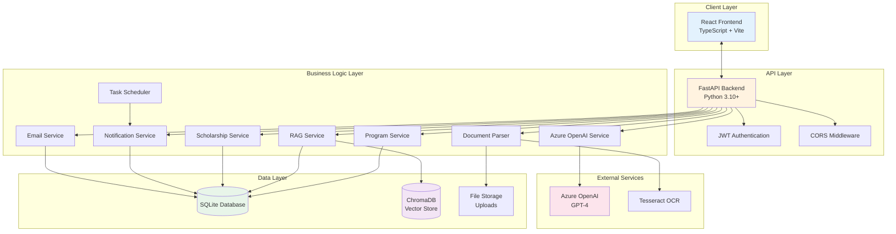
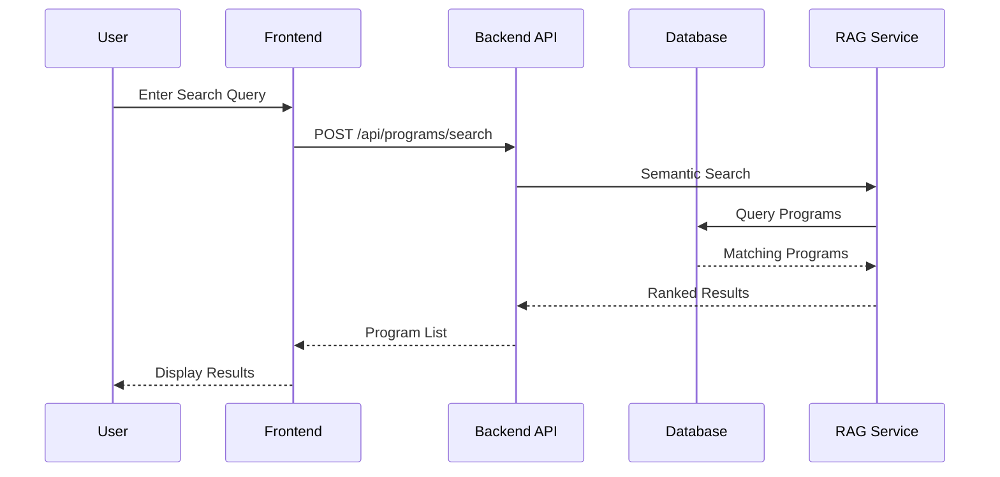
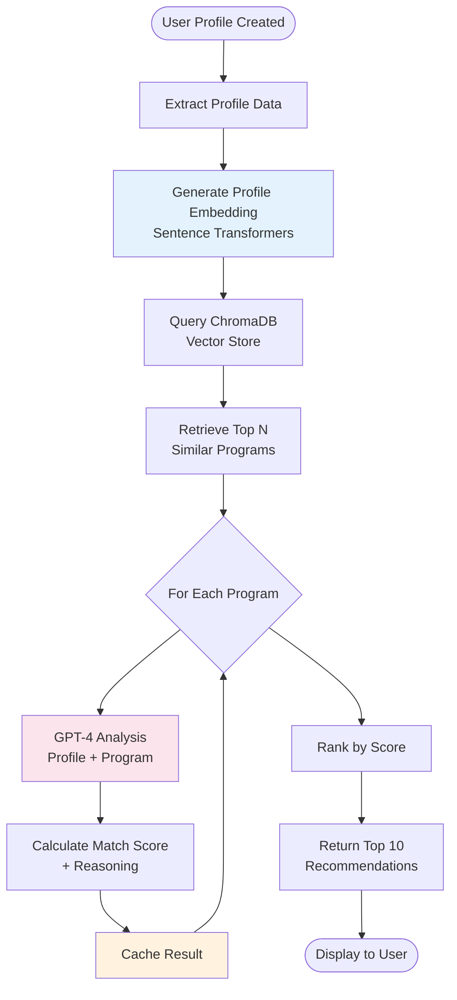
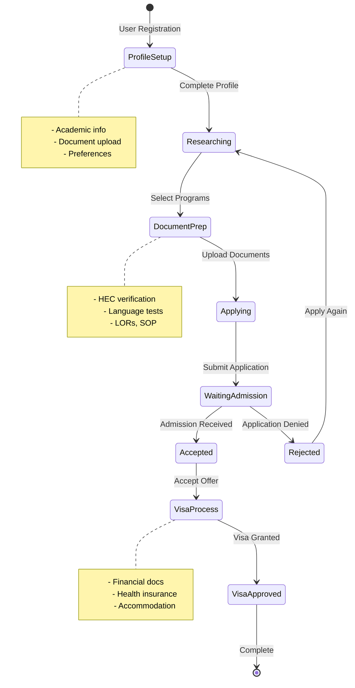
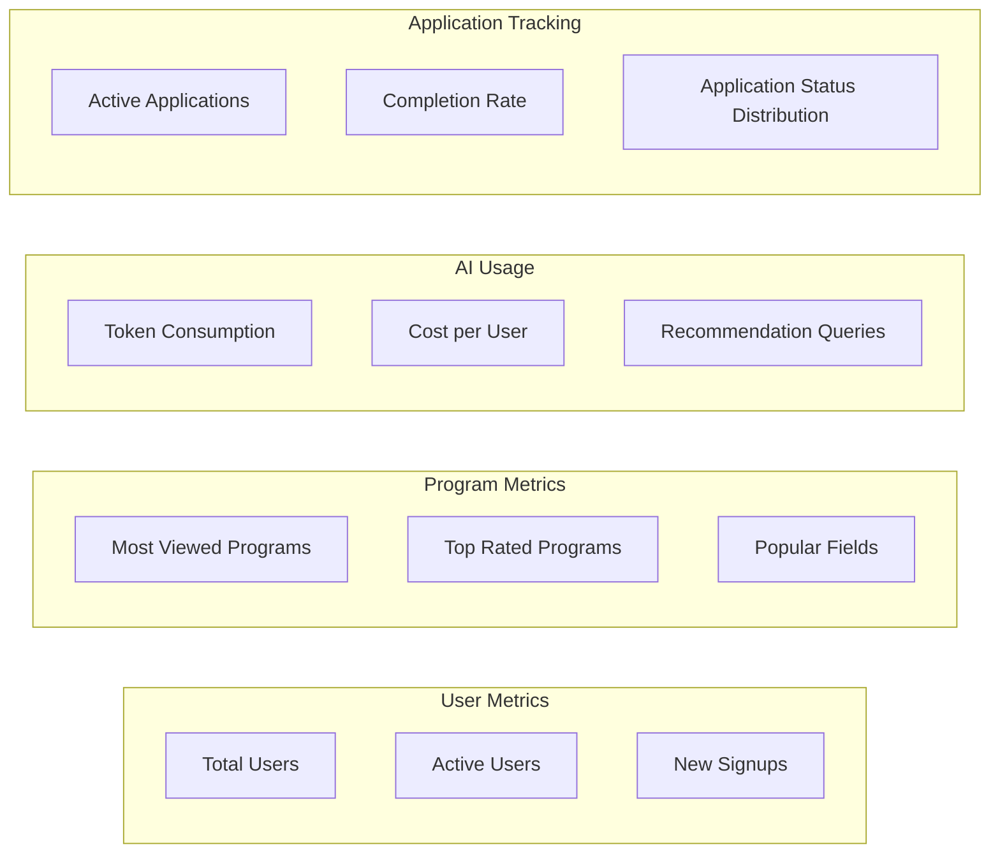
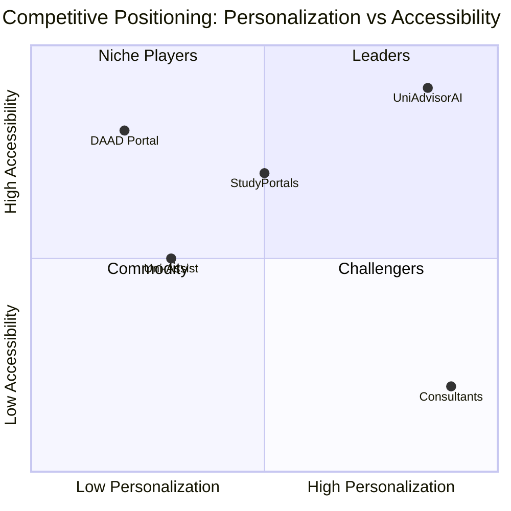
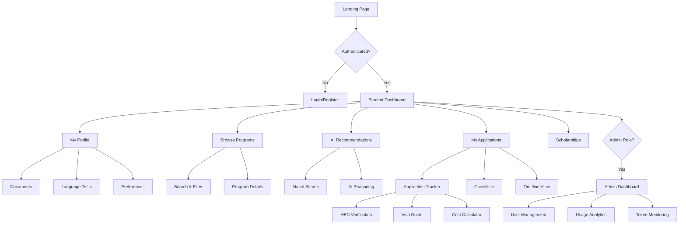

# 📋 Product Requirements Document (PRD)
# UniAdvisorAI - AI-Powered Study Abroad Platform

**Version:** 1.0  
**Last Updated:** February 3, 2026  
**Product Owner:** UniAdvisorAI Team  
**Status:** Active Development

---

## 📌 Executive Summary

**UniAdvisorAI** is an intelligent web application designed to revolutionize how international students discover, evaluate, and apply to German university programs. By combining AI-powered matching algorithms with comprehensive application tracking, the platform addresses the complex challenges of studying abroad in Germany.

### Vision Statement
*"To democratize access to German higher education by providing personalized, AI-driven guidance that matches students with their ideal academic programs and supports them throughout their entire application journey."*

### Core Value Propositions
- **AI-Powered Matching**: Uses Azure OpenAI GPT-4 and RAG (Retrieval Augmented Generation) to provide personalized program recommendations
- **Comprehensive Application Tracking**: End-to-end management from program discovery to visa application
- **Document Intelligence**: Automated extraction and analysis of academic credentials using OCR and NLP
- **Scholarship Discovery**: DAAD scholarship matching with AI-calculated compatibility scores
- **Cost Transparency**: Real-time cost of living information for different German cities

---

## 🎯 Product Goals & Objectives

### Primary Goals
1. **Simplify Program Discovery**: Reduce the time students spend researching German universities from weeks to hours
2. **Increase Application Success Rate**: Help students apply to programs where they have the highest chance of acceptance
3. **Democratize Access**: Make high-quality German education accessible to students from all backgrounds
4. **Streamline Application Process**: Provide a single platform for managing the entire application lifecycle

### Key Metrics for Success
- **User Engagement**: Daily active users, session duration, feature adoption rate
- **Recommendation Quality**: Match score accuracy, user acceptance rate of AI recommendations
- **Application Completion**: Percentage of users who complete applications through the platform
- **User Satisfaction**: NPS score, user retention rate, feature satisfaction ratings

---

## 👥 User Personas

### 1. Ambitious International Student (Primary Persona)
**Name:** Fatima Ahmed  
**Age:** 23  
**Location:** Lahore, Pakistan  
**Background:** Bachelor's in Computer Science, GPA 3.6/4.0  
**Goals:**
- Find a Master's program in Data Science or AI in Germany
- Get admitted to a top-tier university with scholarship support
- Navigate the complex German university application system

**Pain Points:**
- Overwhelmed by 500+ programs across German universities
- Uncertain about eligibility requirements and match quality
- Confused about HEC verification and document attestation process
- Limited information about cost of living and visa requirements

**How UniAdvisorAI Helps:**
- AI recommendations match her profile to suitable programs
- Application tracker guides her through HEC verification
- Cost of living calculator helps with financial planning
- Document parser extracts her transcript information automatically

### 2. Career Switcher
**Name:** Raj Patel  
**Age:** 28  
**Location:** Mumbai, India  
**Background:** Bachelor's in Mechanical Engineering, 3 years work experience  
**Goals:**
- Transition to renewable energy sector via Master's in Germany
- Find programs that value work experience
- Understand visa and admission requirements clearly

**Pain Points:**
- Switching fields makes it hard to assess eligibility
- Needs clear information about application timelines
- Concerned about gaps in academic knowledge

**How UniAdvisorAI Helps:**
- AI analysis considers work experience in match scoring
- Application timeline tracker with deadline reminders
- Eligibility checker compares profile against program requirements

### 3. University Administrator (Secondary Persona)
**Name:** Dr. Hans Mueller  
**Age:** 45  
**Location:** Munich, Germany  
**Role:** International Student Coordinator  
**Goals:**
- Attract qualified international students
- Reduce administrative burden of application screening
- Monitor application trends and student profiles

**How UniAdvisorAI Helps:**
- Analytics dashboard showing student interest patterns
- Token usage monitoring for cost management
- User profile insights for better recruitment strategies

---

## 🏗️ System Architecture

### High-Level Architecture



### Technology Stack

| Layer | Technology | Purpose |
|-------|------------|---------|
| **Frontend** | React 18.2 | UI framework |
| | TypeScript 5.3 | Type-safe JavaScript |
| | Vite 5.0 | Build tool and dev server |
| | TailwindCSS 3.4 | Utility-first CSS |
| | Zustand 4.4 | State management |
| | React Query 5.17 | Server state management |
| | Framer Motion 10.18 | Animations |
| | React Router 6.21 | Client-side routing |
| **Backend** | FastAPI 0.109 | Modern Python web framework |
| | Uvicorn 0.27 | ASGI server |
| | SQLAlchemy 2.0 | ORM and database toolkit |
| | Pydantic 2.6 | Data validation |
| | python-jose 3.3 | JWT handling |
| **AI/ML** | Azure OpenAI | GPT-4 for recommendations |
| | ChromaDB 0.4.22 | Vector database for RAG |
| | Sentence Transformers 2.3 | Text embeddings |
| **Document Processing** | PyPDF2 | PDF text extraction |
| | python-docx | Word document parsing |
| | Pytesseract | OCR for scanned images |
| | Pillow | Image processing |
| **Database** | SQLite | Development database |
| | PostgreSQL | Production-ready option |
| **Authentication** | JWT | Token-based auth |
| | Bcrypt | Password hashing |

---

## ✨ Core Features & Capabilities

### 1. Smart Program Discovery

**Overview**: Browse and filter 500+ German university programs with advanced search capabilities.

**Key Capabilities:**
- Filter by university, city, degree type, language, and field of study
- Semantic search using natural language queries
- Program details including tuition, duration, deadlines, and requirements
- University rankings and location information

**User Flow:**


### 2. AI-Powered Recommendations

**Overview**: Personalized program matching using Azure OpenAI GPT-4 and RAG pipeline.

**Key Capabilities:**
- Profile-based matching considering academic background, work experience, and preferences
- Match score (0-100%) with detailed reasoning
- Multiple matching criteria: academic fit, career alignment, language requirements
- Cached recommendations for performance optimization
- Token usage tracking for cost management

**Technical Implementation:**
- User profile converted to semantic embedding
- ChromaDB vector search finds similar programs
- GPT-4 analyzes profile-program compatibility
- Match score calculation with explainability

**Recommendation Algorithm:**


### 3. Document Intelligence

**Overview**: Automated extraction and analysis of academic documents using OCR and NLP.

**Supported Documents:**
- Academic transcripts
- Degree certificates
- CVs/Resumes
- Language test certificates
- Letters of recommendation
- Research proposals

**Processing Pipeline:**
1. **Upload**: User uploads PDF/DOCX/Image
2. **Text Extraction**: PyPDF2/python-docx for digital docs, Tesseract OCR for scanned images
3. **AI Parsing**: GPT-4 extracts structured data (GPA, courses, grades, dates)
4. **Validation**: Pydantic schemas ensure data quality
5. **Storage**: Metadata stored in database, files in user-specific folders

**Example Extraction:**
```json
{
  "document_type": "transcript",
  "university": "Lahore University of Management Sciences",
  "degree": "Bachelor of Science in Computer Science",
  "gpa": "3.6/4.0",
  "graduation_year": "2023",
  "courses": [
    {"name": "Machine Learning", "grade": "A"},
    {"name": "Data Structures", "grade": "A-"}
  ]
}
```

### 4. Scholarship Matching

**Overview**: DAAD scholarship discovery with AI-calculated eligibility scores.

**Key Features:**
- 100+ DAAD scholarship programs
- Eligibility analysis based on nationality, field of study, degree level
- Compatibility scoring using profile-scholarship matching
- Application deadline tracking
- Funding amount and duration information

**Matching Criteria:**
- Academic excellence (GPA requirements)
- Field of study alignment
- Nationality and country quotas
- Career stage (undergraduate, graduate, postdoc)
- Language proficiency requirements

### 5. Application Tracking System

**Overview**: Comprehensive end-to-end application management from profile setup to visa approval.

**Application Lifecycle:**



**Checklist Categories:**
1. **Profile Setup**: Complete academic background, upload documents
2. **Eligibility Check**: Verify GPA, language scores, prerequisites
3. **Language Requirements**: IELTS, TOEFL, TestDaF tracking
4. **Document Preparation**: Transcripts, degree certificates, CV, SOP, LORs
5. **HEC Verification** (for Pakistan): Degree attestation tracking
6. **University Application**: Portal credentials, application submission
7. **Admission Confirmation**: Offer letter, acceptance
8. **Financial Documents**: Bank statements, scholarship proof, blocked account
9. **Visa Process**: Embassy appointment, biometrics, visa approval

**HEC Verification Tracking** (Pakistan-Specific):
- Status tracking: Not Started → Documents Gathered → Submitted → In Review → Verified
- Tracking number management
- Fee payment tracking (PKR)
- Timeline estimation
- Verification letter storage

### 6. Notifications & Reminders

**Overview**: Automated email notifications for deadlines, application updates, and important milestones.

**Notification Types:**
- **Deadline Reminders**: University application deadlines, scholarship deadlines
- **Application Updates**: Status changes in application tracker
- **Document Expiry**: Language test validity, passport expiration
- **HEC Updates**: Verification status changes
- **System Notifications**: Profile completion reminders, new programs matching profile

**Scheduling System:**
- Background task scheduler using APScheduler
- Configurable notification preferences (email, in-app)
- Reminder intervals: 30 days, 7 days, 1 day before deadline

### 7. Cost of Living Calculator

**Overview**: Detailed cost estimates for different German cities to help with financial planning.

**Cost Categories:**
- **Accommodation**: Dorm, shared apartment, studio apartment
- **Food & Groceries**: Monthly food budget
- **Transportation**: Public transit passes
- **Health Insurance**: Mandatory student health insurance (~110 EUR/month)
- **Miscellaneous**: Books, leisure, phone, internet
- **Semester Fees**: University administrative fees (150-350 EUR)

**Cities Covered:**
- Munich (most expensive)
- Frankfurt, Stuttgart, Hamburg (expensive)
- Berlin, Cologne, Düsseldorf (moderate)
- Leipzig, Dresden, Jena (affordable)

### 8. Visa Guide

**Overview**: Step-by-step guidance for German student visa application process.

**Visa Types:**
- **Student Visa** (nationals from visa-required countries)
- **Student Applicant Visa** (for those without admission yet)
- **EU/EFTA Citizens** (no visa required)

**Required Documents:**
- Valid passport (6+ months validity)
- University admission letter
- Proof of financial resources (blocked account ~11,208 EUR/year)
- Health insurance coverage
- Academic certificates (translated and notarized)
- Motivation letter

### 9. Admin Dashboard

**Overview**: Platform analytics and user management for administrators.

**Admin Capabilities:**
- **User Management**: View, edit, deactivate user accounts
- **Token Usage Monitoring**: Track Azure OpenAI API consumption by user and operation type
- **Cost Analysis**: Daily/monthly token usage with cost estimates
- **Application Metrics**: Track application completion rates
- **Program Analytics**: Most viewed programs, popular fields of study
- **Recommendation Stats**: Cache hit rates, average match scores

**Analytics Dashboard:**


---

## 🔐 Security & Privacy

### Authentication & Authorization
- **JWT-based authentication** with secure token generation
- **Role-based access control**: Admin, Student, Guest
- **Password hashing** using Bcrypt with salt
- **Token expiration**: 24-hour access token validity
- **Secure logout**: Token invalidation

### Data Protection
- **Encrypted storage** of sensitive user documents
- **User-specific upload folders** with access control
- **No password storage** for university portal credentials (username/email only)
- **GDPR compliance considerations**:
  - Right to data deletion
  - Data export functionality
  - Transparent data usage policies

### API Security
- **CORS configuration** restricting origin access
- **Input validation** using Pydantic schemas
- **Rate limiting** (planned for production)
- **SQL injection prevention** via SQLAlchemy ORM
- **File upload validation**: Type, size, and malware scanning (planned)

---

## 📊 Database Schema

### Core Models

**User**
- Authentication (email, hashed_password, role)
- Profile info (full_name, username)
- Status flags (is_active, is_verified)

**UserProfile**
- Academic background (education_level, field_of_study, gpa, university)
- Work experience (years_of_experience, work_details)
- Language proficiency (english_proficiency, german_proficiency)
- Preferences (preferred_cities, study_focus)
- Documents (uploaded files metadata)

**Program**
- Program details (program_name, university_name, degree_type)
- Location (city, country)
- Requirements (academic_requirements, language_requirements)
- Costs (tuition_fees, application_fee)
- Dates (application_deadline, program_start)

**Scholarship**
- DAAD scholarship information
- Eligibility criteria
- Funding details
- Application deadlines

**UserApplication**
- Application tracking
- Status (researching, applying, waiting, accepted, rejected)
- Timeline tracking
- Portal credentials

**ApplicationChecklistItem**
- Category (profile_setup, documents, hec_verification, visa_process)
- Status (not_started, in_progress, completed)
- Due dates and notes

**LanguageProficiencyRecord**
- Test type (IELTS, TOEFL, TestDaF, DSH)
- Scores and band breakdown
- Validity dates
- Certificate storage

**HECVerification** (Pakistan-specific)
- Verification status tracking
- Tracking number
- Fee payment
- Verification letter

**CachedRecommendation**
- Cached AI match results
- Match score and reasoning
- Expiration time

**TokenUsage**
- API consumption tracking
- Cost estimation
- Usage analytics

---

## 🌍 Market Opportunity

### Market Size

**Total Addressable Market (TAM)**:
- **International students in Germany**: 350,000+ (2023)
- **Annual growth rate**: 5-7%
- **Prospective students researching annually**: ~1.5 million worldwide
- **TAM value**: $500M+ (considering education consulting services)

**Serviceable Addressable Market (SAM)**:
- **English-speaking developing countries** (primary focus):
  - Pakistan: 30,000+ students interested in Germany
  - India: 50,000+ students
  - Bangladesh: 15,000+ students
  - African nations: 25,000+ students
- **SAM value**: $150M

**Serviceable Obtainable Market (SOM)**:
- **Year 1 target**: 5,000 active users
- **Year 2 target**: 20,000 active users
- **Year 3 target**: 50,000 active users
- **SOM value**: $15M (Year 3)

### Market Trends

1. **Rising Demand for European Education**:
   - Germany is the 3rd most popular destination for international students
   - No tuition fees at public universities attract students from developing countries
   - Strong engineering and technical programs align with global career demand

2. **AI in EdTech**:
   - AI-powered personalization is becoming standard in education platforms
   - 65% of students prefer AI recommendations over manual research (2024 study)
   - Market expected to grow at 38% CAGR through 2028

3. **Digital Application Management**:
   - Students apply to 5-12 programs on average
   - 80% of students report application tracking as a major pain point
   - Cloud-based application trackers growing at 25% annually

4. **Post-COVID Study Abroad Recovery**:
   - International student mobility recovering to pre-pandemic levels
   - Hybrid learning models make European education more accessible
   - Visa processing streamlined in many countries

### Geographic Focus

**Primary Markets (Phase 1)**:
- 🇵🇰 Pakistan
- 🇮🇳 India
- 🇧🇩 Bangladesh

**Secondary Markets (Phase 2)**:
- 🇳🇬 Nigeria
- 🇰🇪 Kenya
- 🇪🇬 Egypt
- 🇻🇳 Vietnam
- 🇮🇩 Indonesia

**Expansion Markets (Phase 3)**:
- Latin America (Brazil, Mexico)
- Middle East (Saudi Arabia, UAE)
- Eastern Europe (Ukraine, Turkey)

---

## 🏆 Competitive Analysis

### Direct Competitors

| Competitor | Strengths | Weaknesses | UniAdvisorAI Advantage |
|------------|-----------|------------|----------------------|
| **Study in Germany** <br/>(DAAD official portal) | Official information<br/>Comprehensive database | No personalization<br/>Manual research required<br/>No application tracking | AI recommendations<br/>Personalized matching<br/>End-to-end tracking |
| **Uni-Assist** | Centralized application<br/>Trusted by universities | Service fees (75-150 EUR)<br/>No program discovery<br/>Limited guidance | Free platform<br/>Program discovery + application<br/>AI guidance |
| **StudyPortals** | Large database<br/>Multiple countries | Generic recommendations<br/>Paid premium features<br/>No application tracking | Superior AI matching<br/>Free core features<br/>Integrated tracking |
| **Traditional Consultants** | Personalized service<br/>Expert guidance | Very expensive (500-3000 USD)<br/>Limited scalability<br/>Geographic constraints | AI-powered at scale<br/>Free/freemium model<br/>24/7 availability |

### Competitive Positioning



### Unique Value Proposition

**"The only AI-powered platform that combines personalized German university matching with comprehensive application tracking—for free."**

**Key Differentiators:**
1. **AI-Powered Matching**: GPT-4 + RAG for superior recommendation quality
2. **Pakistan-Specific Features**: HEC verification tracking (unique to our platform)
3. **End-to-End Journey**: From discovery to visa, all in one place
4. **Cost Transparency**: Real-time cost of living calculator
5. **Free Core Features**: No paywalls for essential functionality

---

## 💰 Business Model & Monetization

### Revenue Streams

**Phase 1: Freemium Model**
1. **Free Tier** (Core Features):
   - Program search and discovery
   - Up to 10 AI recommendations per month
   - Basic application tracking
   - Document upload and parsing

2. **Premium Tier** ($9.99/month or $79/year):
   - Unlimited AI recommendations
   - Priority support
   - Advanced analytics (personal match trends)
   - Resume/SOP review by AI
   - Application deadline calendar sync
   - Email notifications without limits

**Phase 2: B2B Partnerships**
1. **University Partnerships**: Featured placements, priority listing ($500-2000/month per university)
2. **Language School Partnerships**: Referral fees for German language courses (10-15% commission)
3. **Visa Consulting**: Partner with visa agencies (referral fees)
4. **Accommodation Services**: Partner with student housing providers (booking fees)

**Phase 3: Enterprise Solutions**
1. **White-label for Education Consultants**: SaaS model for consultants ($199-499/month)
2. **University Recruitment Tools**: Analytics dashboards for international offices ($1000+/month)
3. **API Access**: For third-party integrations ($0.01 per API call)

### Cost Structure

**Fixed Costs (Monthly)**:
- Cloud hosting (AWS/GCP): $200-500
- Azure OpenAI API: $500-2000 (variable with usage)
- Domain and CDN: $50
- Email service (SendGrid): $100
- Development team: $8000-15000

**Variable Costs**:
- Azure OpenAI tokens: ~$0.01-0.03 per user per recommendation
- Storage: ~$0.10 per GB
- Customer support: Scales with users

**Unit Economics (Premium User)**:
- Monthly revenue: $9.99
- Variable cost: ~$1.50 (AI tokens + infrastructure)
- Contribution margin: $8.49 (85%)

---

## 🚀 Product Roadmap & TODOs

### Phase 1: MVP Enhancement (Q1-Q2 2026)

#### High Priority TODOs

**Backend Enhancements**
- [ ] Migrate from SQLite to PostgreSQL for production scalability
- [ ] Implement Redis caching for API responses and recommendations
- [ ] Add rate limiting for API endpoints (prevent abuse)
- [ ] Enhance error logging with Sentry integration
- [ ] Add database backup automation
- [ ] Implement API versioning (/api/v1/)

**AI/ML Improvements**
- [ ] Fine-tune embedding model for German university programs
- [ ] A/B test different prompt engineering strategies for GPT-4
- [ ] Implement recommendation explanation quality scoring
- [ ] Add user feedback loop for match accuracy
- [ ] Reduce Azure OpenAI costs by 30% through prompt optimization
- [ ] Implement local LLM fallback for basic queries

**Application Tracking**
- [ ] Add email parsing for automatic status updates (admission emails)
- [ ] Implement calendar integration (Google Calendar, Outlook)
- [ ] Add document checklist templates for popular universities
- [ ] Create visa appointment booking integration
- [ ] Build financial documentation calculator
- [ ] Add application fee payment tracking

**Frontend Improvements**
- [ ] Dark mode implementation
- [ ] Mobile app (React Native) for iOS and Android
- [ ] Progressive Web App (PWA) for offline access
- [ ] Accessibility improvements (WCAG 2.1 AA compliance)
- [ ] Multi-language support (German, Urdu, Hindi)
- [ ] Performance optimization (lazy loading, code splitting)

**Security & Compliance**
- [ ] Implement GDPR data export functionality
- [ ] Add 2FA (Two-Factor Authentication)
- [ ] Security audit and penetration testing
- [ ] HTTPS enforcement
- [ ] Data encryption at rest
- [ ] Privacy policy and terms of service finalization

### Phase 2: Scale & Expand (Q3-Q4 2026)

**New Features**
- [ ] SOP (Statement of Purpose) AI generator
- [ ] LOR (Letter of Recommendation) template generator
- [ ] Interview preparation AI assistant
- [ ] Peer community forum for students
- [ ] Mentor matching (connect with current students)
- [ ] Virtual campus tours integration
- [ ] Scholarship application automation
- [ ] Financial aid calculator and planner

**Geographic Expansion**
- [ ] Add Netherlands universities (300+ programs)
- [ ] Add Austria universities (200+ programs)
- [ ] Add Swiss universities (150+ programs)
- [ ] Localization for Indian languages (Hindi, Tamil, Telugu)
- [ ] Partner with education consultants in Nigeria, Kenya

**Partnerships**
- [ ] DAAD official partnership for data feed
- [ ] University direct application integration (APIs)
- [ ] German language course provider partnerships (Goethe-Institut)
- [ ] Student accommodation platforms (Uniplaces, HousingAnywhere)
- [ ] Health insurance providers (TK, AOK student plans)

**Analytics & Insights**
- [ ] Student success tracking (admission rates by program)
- [ ] Personalized application strategy recommendations
- [ ] Cohort analysis (admission trends by nationality, field)
- [ ] Predictive analytics (admission chances prediction)

### Phase 3: Platform Maturity (2027)

**Advanced Features**
- [ ] Blockchain-verified academic credentials
- [ ] AI-powered career counseling
- [ ] Job placement assistance in Germany
- [ ] Alumni network platform
- [ ] Study group formation AI matching
- [ ] Research supervisor matching for PhD students
- [ ] Grant and research funding discovery

**Monetization Enhancement**
- [ ] Premium university profiles with videos and virtual tours
- [ ] Priority application review service (partner universities)
- [ ] Career bootcamps and online courses
- [ ] Visa interview coaching service

**Enterprise Solutions**
- [ ] White-label platform for education consultants
- [ ] University recruitment CRM integration
- [ ] Analytics API for education market research
- [ ] Automated eligibility pre-screening for universities

---

## 📈 Success Metrics & KPIs

### Product Metrics

| Metric | Target (Year 1) | Target (Year 2) | Measurement |
|--------|----------------|----------------|-------------|
| **Monthly Active Users (MAU)** | 2,000 | 10,000 | Google Analytics |
| **Recommendation Accuracy** | 75% | 85% | User feedback surveys |
| **Application Completion Rate** | 30% | 50% | Applications completed/started |
| **Average Session Duration** | 12 min | 18 min | Analytics |
| **User Retention (30-day)** | 40% | 60% | Cohort analysis |
| **NPS Score** | 50+ | 70+ | Quarterly surveys |

### Business Metrics

| Metric | Target (Year 1) | Target (Year 2) | 
|--------|----------------|----------------|
| **Registered Users** | 5,000 | 25,000 |
| **Premium Conversion Rate** | 3% | 8% |
| **Monthly Recurring Revenue (MRR)** | $500 | $5,000 |
| **Customer Acquisition Cost (CAC)** | $5 | $3 |
| **Lifetime Value (LTV)** | $30 | $60 |
| **LTV:CAC Ratio** | 6:1 | 20:1 |

### Technical Metrics

| Metric | Target | Monitoring Tool |
|--------|--------|----------------|
| **API Response Time (p95)** | < 500ms | DataDog/New Relic |
| **Uptime** | 99.5% | UptimeRobot |
| **Error Rate** | < 0.5% | Sentry |
| **Azure OpenAI Cost per User** | < $0.50/month | Custom dashboard |
| **Database Query Time (p95)** | < 100ms | PostgreSQL monitoring |

---

## 🎨 User Experience & Design Principles

### Core UX Principles

1. **Simplicity First**: Complex processes broken into digestible steps
2. **Transparency**: Clear explanations for AI recommendations
3. **Guidance**: Contextual help and tooltips throughout the journey
4. **Reassurance**: Progress indicators and completion percentages
5. **Accessibility**: WCAG 2.1 compliant, keyboard navigation, screen reader support

### Information Architecture



### Mobile-First Design

- **Responsive Breakpoints**: Mobile (< 768px), Tablet (768-1024px), Desktop (> 1024px)
- **Touch-Friendly**: Minimum 44x44px touch targets
- **Offline Support**: PWA with service worker caching
- **Performance**: < 3s page load on 3G networks

---

## 🔬 Technical Challenges & Solutions

### Challenge 1: RAG Performance at Scale

**Problem**: ChromaDB vector search may slow down with 10,000+ programs and growing user base.

**Solutions**:
- Implement HNSW indexing for faster approximate nearest neighbor search
- Add Redis caching layer for frequent queries
- Partition vector database by degree type and field
- Pre-compute embeddings during off-peak hours
- Consider migration to Pinecone or Weaviate for better scalability

### Challenge 2: Azure OpenAI Cost Management

**Problem**: GPT-4 API costs can become prohibitive at scale (estimated $2-5 per user monthly).

**Solutions**:
- Aggressive caching of recommendations (7-day TTL)
- Use GPT-3.5-turbo for simpler queries
- Implement prompt compression techniques
- Fine-tune smaller models for specific tasks
- Set per-user monthly token limits
- Explore open-source LLM alternatives (Llama 3, Mistral) for non-critical features

### Challenge 3: Multi-Country HEC Verification

**Problem**: HEC verification is Pakistan-specific; other countries have different attestation processes.

**Solutions**:
- Create modular attestation tracking system
- Country-specific workflow configurations
- Partner with credential evaluation services (WES, ECE)
- Build plugin architecture for country-specific processes
- User-configurable custom checklists

### Challenge 4: Data Quality & Program Updates

**Problem**: University programs change annually (deadlines, requirements, fees).

**Solutions**:
- Implement web scraping automation (DAAD database, university websites)
- Build change detection system with diffs
- Admin approval workflow for auto-updated data
- User-contributed updates with verification
- Partnership with DAAD for official data feed
- Semester-based data refresh cycles

---

## 🌟 Future Vision (3-5 Years)

### The Complete Study Abroad Ecosystem

**Vision**: UniAdvisorAI evolves from a German university platform to a comprehensive global study abroad ecosystem, covering 15+ countries and 50,000+ programs.

**Expanded Offerings**:
1. **Global Coverage**: USA, UK, Canada, Australia, Netherlands, Switzerland, France
2. **Entire Student Lifecycle**: From program selection to graduation and job placement
3. **AI Career Advisor**: Long-term career planning aligned with academic choices
4. **Financial Services**: Student loans, scholarships, part-time job matching
5. **Community Platform**: Forums, study groups, mentor-mentee matching
6. **Mobile-First Experience**: Native iOS/Android apps with AR campus tours
7. **Blockchain Credentials**: Verified academic records on blockchain
8. **AI Teaching Assistant**: Personalized learning support during studies

**Impact Goals**:
- **100,000+ students** helped annually
- **$50M+ in scholarships** accessed through platform
- **80%+ admission success** rate for recommended programs
- **Top 3 global** study abroad platform by user satisfaction

---

## 📚 Appendices

### Appendix A: API Endpoints Summary

**Authentication**
- `POST /api/auth/register` - User registration
- `POST /api/auth/login` - User login
- `POST /api/auth/logout` - User logout

**Programs**
- `GET /api/programs` - List programs with filters
- `GET /api/programs/{id}` - Program details
- `GET /api/programs/universities` - List universities
- `GET /api/programs/stats` - Program statistics

**Recommendations**
- `GET /api/recommendations` - Get AI recommendations
- `POST /api/recommendations/generate` - Trigger recommendation generation
- `GET /api/recommendations/scholarships` - Scholarship recommendations

**Profile**
- `GET /api/profile` - Get user profile
- `PUT /api/profile` - Update profile
- `POST /api/profile/upload-document` - Upload document
- `GET /api/profile/documents` - List documents

**Applications**
- `POST /api/applications` - Create application
- `GET /api/applications` - List user applications
- `PUT /api/applications/{id}` - Update application status
- `GET /api/applications/{id}/checklist` - Get application checklist

**Admin**
- `GET /api/admin/users` - List all users
- `GET /api/admin/token-usage` - Token usage analytics
- `GET /api/admin/dashboard` - Dashboard statistics

### Appendix B: Glossary

- **DAAD**: German Academic Exchange Service (Deutscher Akademischer Austauschdienst)
- **HEC**: Higher Education Commission (Pakistan)
- **RAG**: Retrieval Augmented Generation
- **LOR**: Letter of Recommendation
- **SOP**: Statement of Purpose
- **GPA**: Grade Point Average
- **IELTS**: International English Language Testing System
- **TOEFL**: Test of English as a Foreign Language
- **TestDaF**: Test Deutsch als Fremdsprache (German proficiency test)
- **DSH**: Deutsche Sprachprüfung für den Hochschulzugang
- **NC**: Numerus Clausus (restricted enrollment)
- **ECTS**: European Credit Transfer System

### Appendix C: References

1. DAAD Official Statistics: https://www.daad.de/en/
2. Statista Higher Education Market Reports
3. UNESCO Institute for Statistics - Global Flow of Tertiary-Level Students
4. German Academic Exchange Service - "Wissenschaft weltoffen 2024"
5. Azure OpenAI Pricing: https://azure.microsoft.com/en-us/pricing/details/cognitive-services/openai-service/

---

## 📝 Document Control

| Version | Date | Author | Changes |
|---------|------|--------|---------|
| 1.0 | Feb 3, 2026 | UniAdvisorAI Team | Initial comprehensive PRD |

---

**Note**: This PRD is a living document and should be updated regularly as the product evolves and new insights emerge from user feedback and market analysis.
