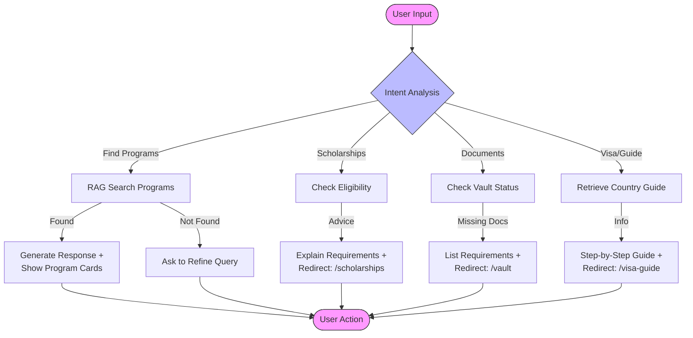
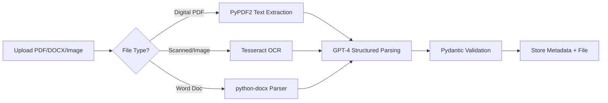
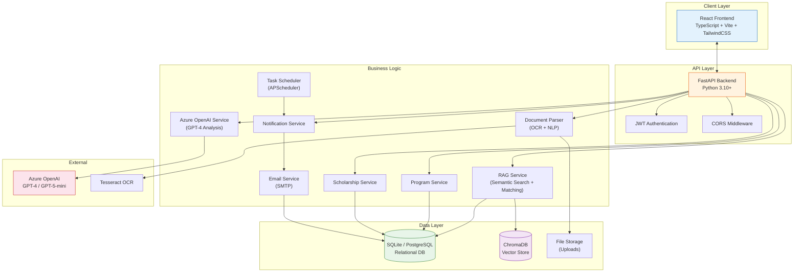
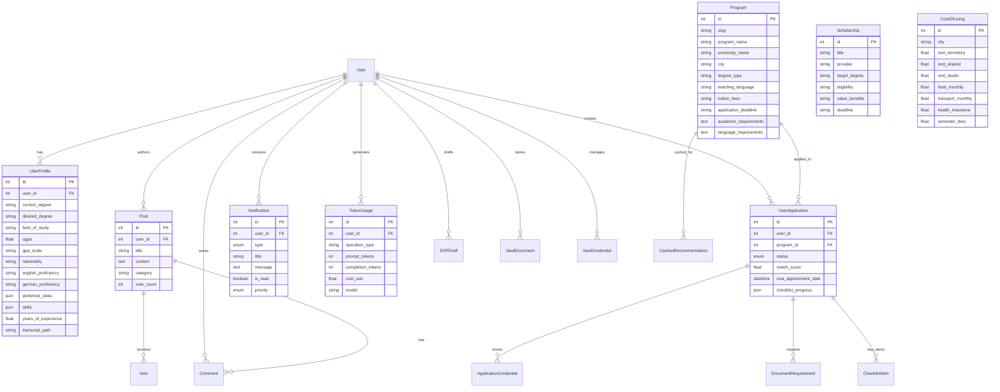
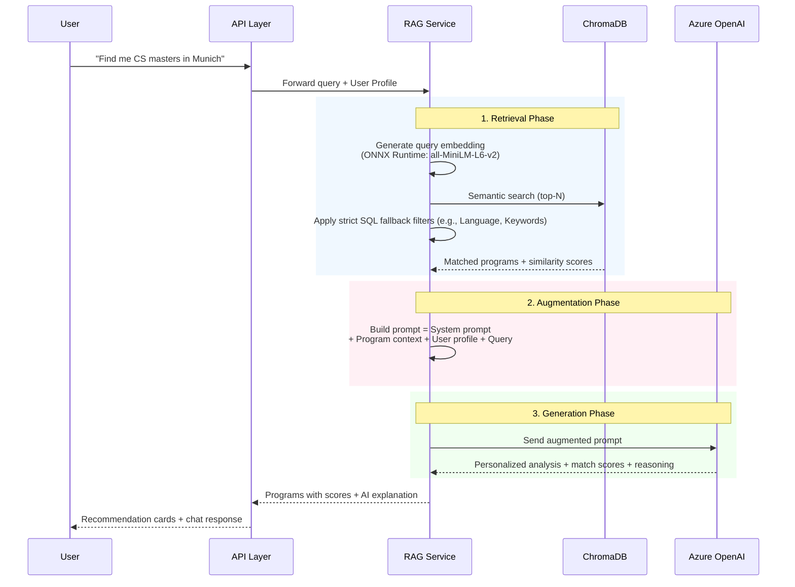
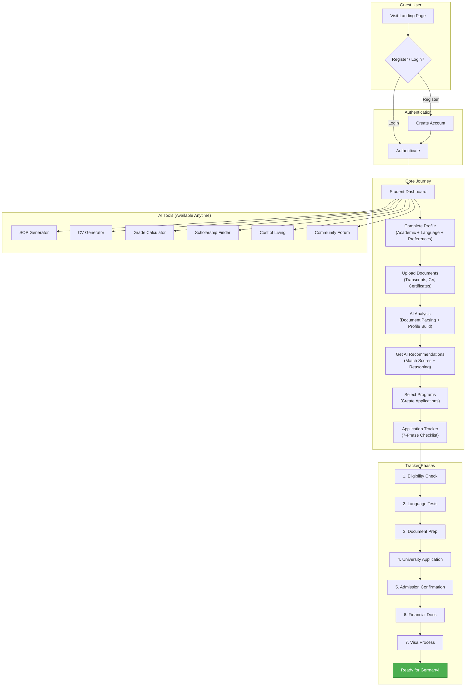
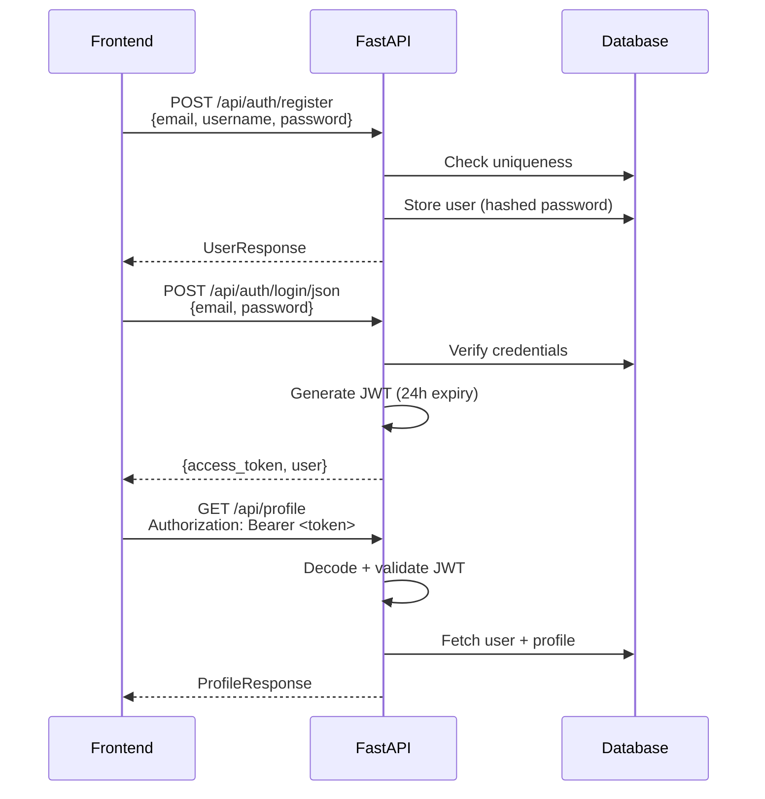

# UniAdvisorAI — AI-Powered Study in Germany Platform 

<div align="center">

**The only AI-powered platform that combines personalized German university matching with comprehensive application tracking — for free.**

[](https://reactjs.org/)
[](https://fastapi.tiangolo.com/)
[](https://azure.microsoft.com/en-us/products/ai-services/openai-service)
[](https://www.typescriptlang.org/)
[](https://python.org/)
[](./LICENSE)

</div>

---

## 📌 Overview

**UniAdvisorAI** is a comprehensive, AI-powered web application designed to revolutionize how international students discover, evaluate, and apply to German university programs. By combining **RAG-based AI matching** (Retrieval Augmented Generation using Azure OpenAI GPT-4 and ChromaDB), **end-to-end application tracking**, **AI document generation**, and **scholarship matching**, the platform addresses every stage of the study abroad journey — from program discovery to visa approval.

### Who is this for?

| Persona | Description | Key Features Used |
|---------|-------------|-------------------|
| **International Student** | Looking for Master's/PhD programs in Germany | AI Recommendations, Application Tracker, SOP/CV Generator |
| **Career Switcher** | Transitioning fields via a German degree | AI matching considers work experience, eligibility checker |
| **University Admin** | Managing international applications | Admin Dashboard, token analytics, user management |

### Target Markets (15+ Countries)

**Primary:** Pakistan · India · Bangladesh 
**Secondary:** Nigeria · Kenya · Egypt · Vietnam · Indonesia 
**Expansion:** Turkey · Iran · China · USA · UK · Canada · Russia

---

## Features at a Glance

| # | Feature | Description | Status |
|---|---------|-------------|--------|
| 1 | [Smart Program Discovery](#1--smart-program-discovery) | Browse & filter 2500+ programs with semantic search | Live |
| 2 | [AI-Powered Recommendations](#2--ai-powered-recommendations--chat) | GPT-4 + RAG personalized matching with Two-Step Evaluation | Live |
| 3 | [AI Chat Advisor](#2--ai-powered-recommendations--chat) | Conversational Q&A about programs | Live |
| 4 | [Application Tracker](#3--application-tracker) | 7-phase checklist with country-specific workflows | Live |
| 5 | [AI SOP Generator](#4--ai-tools-suite) | Generate tailored Statements of Purpose | Live |
| 6 | [AI CV Generator](#4--ai-tools-suite) | Build German-style CVs with AI feedback | Live |
| 7 | [German Grade Calculator](#4--ai-tools-suite) | Modified Bavarian Formula converter | Live |
| 8 | [Scholarship Matching](#5--scholarship-matching) | Scholarships with AI eligibility scoring | Live |
| 9 | [Document Vault](#6--document-vault) | Secure document storage & credential management | Live |
| 10 | [Cost of Living Calculator](#7--cost-of-living-calculator) | City-specific expense estimates | Live |
| 11 | [Visa Guide](#8--visa-guide--country-guides) | Step-by-step visa process for each country | Live |
| 12 | [Country Guides](#8--visa-guide--country-guides) | SEO-optimized per-country study guides | Live |
| 13 | [University Explorer](#9--university-explorer) | University listings with detail pages | Live |
| 14 | [Community Hub](#10--community-hub) | Forum with posts, comments, voting | Live |
| 15 | [Notifications System](#11--notifications--reminders) | In-app + email notifications with scheduling | Live |
| 16 | [Admin Dashboard](#12--admin-dashboard) | User management, token analytics, data imports | Live |
| 17 | [Document Intelligence](#13--document-intelligence) | AI-powered transcript/CV parsing via OCR | Live |
| 18 | [SEO & AEO](#14--seo--aeo) | Structured data, meta tags, hreflang support | Live |

---

## Detailed Feature Documentation

### 1. Smart Program Discovery

Browse and filter **500+ German university programs** with advanced search capabilities.

**Capabilities:**
- **Multi-filter search:** University, city, degree type (Bachelor/Masters/PhD), teaching language, field of study
- **Semantic search:** Natural language queries powered by ONNX-based `all-MiniLM-L6-v2` embeddings + ChromaDB
- **Grid/List view toggle** for different browsing preferences
- **Program detail pages** with tuition fees, deadlines, requirements, duration, and application links
- **Public access** — no login required to browse

**Filterable Cities:** Munich, Berlin, Hamburg, Stuttgart, Frankfurt, Cologne, Dresden, Aachen, Heidelberg, Freiburg, and more.

**Route:** `/programs` → `/programs/:id`

---

### 2. AI-Powered Recommendations & Chat Nova Nova

Personalized program matching using **Azure OpenAI GPT-4** and **RAG pipeline**.

**Recommendation Engine:**
- Profile-based matching considering academic background, GPA, field of study, work experience, language proficiency, and preferences
- **Match score (0–100%)** with detailed AI-generated reasoning
- Multiple matching criteria: academic fit, career alignment, language requirements, deadline feasibility
- **Two-Step AI Evaluation:** The LLM strictly enforces domain relevance before scoring peripheral factors (GPA, language), eliminating hallucinations
- **Real-Time SSE Streaming:** Results stream in progressively with shimmer skeleton loader cards for instant perceived loading
- **Cached recommendations** with profile-hash invalidation for performance
- **Token usage tracking** per operation for cost management

**Chat Nova Interface:**
Chat Nova is your personal AI study abroad assistant, created by Musawar. It helps you navigate the complexities of studying in Germany with ease.

- **How it works:** Nova is grounded in the UniAdvisor database and your personal profile. It understands your academic background and preferences to provide tailored advice, from program searches to visa application steps.
- **Context-aware:** Uses your profile + program database for answers
- **Interactive:** Full conversational interface with markdown rendering
- **Persona:** Friendly, knowledgeable, and encouraging guide
- **Access:** Admin users get unlimited access; regular users have daily rate limits

**Technical Flow:**


**Route:** `/recommendations` (protected)

---

### 3. Application Tracker

The most comprehensive feature — a **7-phase, country-specific** application management system.

**Phases:**
| Phase | Icon | Description |
|-------|------|-------------|
| 1. Eligibility | | GPA check, prerequisite verification, field matching |
| 2. Language | | IELTS/TOEFL/TestDaF score tracking, certificate management |
| 3. Documents | | Transcript, degree, SOP, LOR, CV preparation tracking |
| 4. Application | | University portal credentials, submission tracking |
| 5. Admission | | Offer letter status, acceptance management |
| 6. Finance | | Blocked account, bank statements, scholarship proof |
| 7. Visa | | Embassy appointment, biometrics, visa approval tracking |

**Country-Specific Features (7 countries):**

| Country | Verification Process | Embassy Cities | GPA Scale |
|---------|---------------------|----------------|-----------|
| India | APS India + MEA Apostille | New Delhi, Mumbai, Chennai, Bangalore, Kolkata | 10.0 |
| China | APS Beijing | Beijing, Shanghai, Guangzhou, Chengdu | 100 |
| Iran | Legalization (No Apostille) | Tehran | 20.0 |
| Turkey | Apostille (Hague Convention) | Ankara, Istanbul, Izmir | 4.0 |
| Pakistan | IBCC + HEC + MOFA Attestation | Islamabad, Karachi | 4.0 |
| Bangladesh | MoFA Apostille + Embassy | Dhaka | 4.0 |
| USA | Apostille (Secretary of State) | Washington DC, NYC, LA, Chicago, Houston | 4.0 |

Each country includes:
- Step-by-step verification instructions
- Direct links to verification offices (Google Maps)
- Embassy/consulate appointment URLs
- Visa document checklists (linked to official embassy PDFs)

**GPA Calculator:** Built-in Modified Bavarian Formula converter with per-country min-passing-grade calibration.

**Route:** `/applications` → `/applications/:id`

---

### 4. AI Tools Suite

#### SOP Generator (Statement of Purpose)
- **AI-generated** SOPs based on your profile, target university, and chosen program
- **Form-based input** with pre-fill from user profile
- **Export formats:** PDF, Word (.docx), clipboard copy
- **Draft management:** Save, restore, delete, and favorite drafts
- **Save to Vault** integration for document management
- **SEO:** Schema.org WebApplication + FAQ structured data

**Route:** `/tools/sop-generator`

#### CV Generator (Curriculum Vitae)
- **Two modes:** Upload existing CV for AI feedback, or build from scratch
- **AI feedback panel** with:
 - Overall score (0–100)
 - Strength analysis per section
 - Improvement suggestions with priority levels
 - Missing items identification
- **Sections:** Personal Info, Education, Research Experience, Work Experience, Publications, Awards, Skills, Languages, Certifications, References
- **German academic CV format** (Lebenslauf) aligned with university expectations

**Route:** `/tools/cv-generator`

#### German Grade Calculator
- Convert any grading scale to the German system (1.0–4.0) using the **Modified Bavarian Formula**
- Supports all 7 country-specific scales automatically
- Visual explanation of how the formula works

**Route:** `/german-grade-calculator`

---

### 5. Scholarship Matching

Discover **Scholarships** with AI-calculated compatibility scores.

**Capabilities:**
- Browse with filters (field, degree level, nationality)
- **"Find My Scholarships"** — one-click profile-based matching
- **AI eligibility scoring** via GPT-4 analyzing your profile against each scholarship
- Detailed scholarship pages with funding amount, duration, eligibility criteria, and deadlines
- Scholarship data seeded from curated DAAD JSON dataset

**Route:** `/scholarships` → `/scholarships/:id`

---

### 6. Document Vault

Secure, centralized storage for all your application documents.

**Document Management:**
- Upload documents organized by category (Transcripts, Certificates, SOPs, CVs, Language Tests, etc.)
- Download, preview, and delete uploaded files
- Auto-saves documents generated by SOP/CV tools

**Credential Manager:**
- Store university portal login credentials securely
- Quick access during application phase

**Route:** `/vault` (protected)

---

### 7. Cost of Living Calculator

City-specific expense estimations for financial planning.

**Cities Covered:** Munich, Berlin, Hamburg, Frankfurt, Stuttgart, Cologne, Dresden, Leipzig, Jena, and more.

**Cost Categories:**
| Category | Example (Munich) | Example (Leipzig) |
|----------|-------------------|---------------------|
| Accommodation | €700–1,200/mo | €300–600/mo |
| Food & Groceries | €250–400/mo | €180–280/mo |
| Transportation | €55/mo (semester ticket) | €40/mo |
| Health Insurance | €110/mo | €110/mo |
| Semester Fees | €150–350/semester | €150–250/semester |
| Miscellaneous | €150–300/mo | €100–200/mo |

**Lifestyle Modes:** Budget, Moderate, Comfortable — each with different total estimates.

**Route:** `/costofliving` → `/cost-of-living/:city`

---

### 8. Visa Guide & Country Guides

#### Visa Guide
- Step-by-step German student visa application process
- Required documents checklist
- Visa types explained (Student Visa, Applicant Visa, EU/EFTA citizens)
- Financial requirements (blocked account €11,208/year)

**Route:** `/visa-guide`

#### Country Guides
- SEO-optimized guides for studying in Germany from specific countries
- Tailored advice, verification steps, and FAQ per nationality
- URL structure: `/study-in-germany/from/:country`

---

### 9. University Explorer

Browse partner universities with comprehensive information.

**Features:**
- University listing with search
- Individual university detail pages
- Programs offered per university
- Location, tuition, rankings, and key statistics

**Route:** `/universities` → `/universities/:name`

---

### 10. Community Hub

Student forum for sharing experiences and asking questions.

**Features:**
- **Create posts** with title, content, and category (Visa, Housing, Scholarships, etc.)
- **Upvote/downvote** system for quality content
- **Threaded comments** on each post
- **Search** through posts
- **Auth gating** — view as guest, post when logged in

**Route:** `/community` → `/community/posts/:id`

---

### 11. Notifications & Reminders

Automated, proactive notification system powered by **APScheduler**.

**Notification Types:**
| Type | Trigger | Channel |
|------|---------|---------|
| Deadline Reminders | 30, 7, 1 day before application deadline | In-app + Email |
| Visa Reminders | Upcoming visa appointments | In-app + Email |
| Status Changes | Application status updates | In-app + Email |
| Weekly Digest | Every Monday 9 AM — progress summary | Email |

**User Preferences:**
- Per-type toggle for in-app and email notifications
- Configurable via Settings page

**Route:** `/settings/notifications` (protected)

---

### 12. Admin Dashboard

Platform analytics and management for administrators.

**Capabilities:**
- **User Management:** View all users, manage accounts
- **Token Usage Analytics:** Track Azure OpenAI API consumption per user/operation with cost estimates
- **Program Management:** Re-index RAG service, import programs from JSON
- **Usage Breakdown:** Daily/monthly cost analysis

**Route:** `/admin` (protected, admin-only)

---

### 13. Document Intelligence

AI-powered document parsing for automated information extraction.

**Supported Documents:** Academic transcripts, degree certificates, CVs/resumes, language certificates

**Processing Pipeline:**


**Extracted Data Example:**
```json
{
 "document_type": "transcript",
 "university": "LUMS",
 "degree": "BSc Computer Science",
 "gpa": "3.6/4.0",
 "graduation_year": "2023",
 "courses": [
 {"name": "Machine Learning", "grade": "A"},
 {"name": "Data Structures", "grade": "A-"}
 ]
}
```

---

### 14. SEO & AEO

Built-in Search Engine and Answer Engine Optimization.

**Implementation:**
- **React Helmet Async** for dynamic meta tags per page
- **Open Graph** (Facebook) + **Twitter Card** tags
- **Canonical URLs** with automatic fallback
- **Hreflang tags** for international targeting
- **JSON-LD structured data** (Schema.org) — WebApplication, FAQ, and more
- **Semantic HTML** — proper heading hierarchy, descriptive IDs
- **Automated Sitemap Generation** — `generate_sitemap.py` script to instantly build `sitemap.xml` for all dynamic program and university routes
- **SEO-friendly URL structure:**
 - `/programs/:slug` — individual programs
 - `/universities/:name` — universities
 - `/scholarships/:id` — scholarships
 - `/cost-of-living/:city` — per-city pages
 - `/study-in-germany/from/:country` — country guides

---

## System Architecture

### High-Level Architecture



### Technology Stack

| Layer | Technology | Purpose |
|-------|------------|---------|
| **Frontend** | React 18.2, TypeScript 5.3 | UI framework + type safety |
| | Vite 5.0 | Build tool and dev server |
| | TailwindCSS 3.4 | Utility-first CSS styling |
| | Zustand 4.4 | Lightweight state management |
| | React Query (TanStack) 5.17 | Server state, caching, mutations |
| | Server-Sent Events (SSE) | Real-time streaming for AI recommendations |
| | Framer Motion 10.18 | Animations and transitions |
| | React Router 6.21 | Client-side routing |
| | React Helmet Async | SEO meta tag management |
| | react-hook-form | Form handling with validation |
| | jsPDF + docx | PDF/Word export for AI tools |
| | ReactMarkdown | Render AI chat responses |
| **Backend** | FastAPI 0.109 | Modern async Python web framework |
| | Uvicorn 0.27 | ASGI server |
| | SQLAlchemy 2.0 | ORM and database toolkit |
| | Pydantic 2.6 | Data validation and serialization |
| | python-jose 3.3 | JWT token handling |
| | APScheduler | Background task scheduling |
| **AI/ML** | Azure OpenAI (GPT-4 / GPT-5-mini) | Recommendations, chat, analysis, document parsing |
| | ChromaDB 0.4.22 | Vector database for semantic search |
| | ONNX Runtime | Lightweight execution environment for embeddings (RAM optimizer) |
| | all-MiniLM-L6-v2 | Default embedding model (used via ONNX) |
| **Document Processing** | PyPDF2 | PDF text extraction |
| | python-docx | Word document parsing |
| | Pytesseract + Pillow | OCR for scanned images |
| **Database** | SQLite (development) | Embedded relational database |
| | PostgreSQL (production) | Scalable production database |
| **Auth** | JWT (HS256) | Token-based authentication |
| | OAuth2 Password Flow | Standard auth protocol |

---

## 📂 Project Structure

```
UniAdvisorAI/
├── backend/
│ ├── app/
│ │ ├── main.py     # FastAPI entry point, lifespan events
│ │ ├── config.py    # Pydantic settings (env-based)
│ │ ├── database.py    # SQLAlchemy engine + session
│ │ ├── auth.py     # JWT + password utilities
│ │ ├── routers/    # API endpoint handlers
│ │ │ ├── auth.py    # Registration, login, password reset
│ │ │ ├── programs.py   # Program CRUD, search, import
│ │ │ ├── profile.py   # Profile + document upload
│ │ │ ├── recommendations.py # AI recommendations + chat
│ │ │ ├── scholarships.py  # Scholarship listing + eligibility
│ │ │ ├── applications.py  # Application tracker + checklist
│ │ │ ├── vault.py   # Document vault + credentials
│ │ │ ├── community.py  # Posts, comments, voting
│ │ │ ├── notifications.py # Notification CRUD + preferences
│ │ │ ├── sop.py    # SOP generation
│ │ │ ├── cv_generator.py  # CV generation + feedback
│ │ │ ├── users.py   # User management (admin)
│ │ │ └── token_usage.py  # Token analytics (admin)
│ │ ├── services/    # Business logic layer
│ │ │ ├── rag_service.py  # RAG pipeline (ChromaDB + embeddings)
│ │ │ ├── azure_openai.py  # GPT-4 integration (21 methods)
│ │ │ ├── program_service.py # Program search + filtering
│ │ │ ├── scholarship_service.py # Scholarship data management
│ │ │ ├── notification_service.py # Notification creation + delivery
│ │ │ ├── email_service.py # SMTP email delivery
│ │ │ ├── document_parser.py # OCR + text extraction
│ │ │ └── scheduler.py  # APScheduler background tasks
│ │ ├── models/     # SQLAlchemy ORM models (14 files)
│ │ └── schemas/    # Pydantic DTOs (13 files)
│ ├── requirements.txt
│ ├── .env      # Environment variables
│ └── chroma_db/     # ChromaDB vector store data
│
├── frontend/
│ ├── src/
│ │ ├── App.tsx     # Route configuration (31 routes)
│ │ ├── main.tsx    # React entry point
│ │ ├── index.css    # Global styles
│ │ ├── pages/     # 19 page directories
│ │ │ ├── Landing/   # Public landing page
│ │ │ ├── Auth/    # Login, Register, Password Reset
│ │ │ ├── Dashboard/   # Student dashboard
│ │ │ ├── Programs/   # Program listing + detail
│ │ │ ├── Universities/  # University listing + detail
│ │ │ ├── Recommendations/ # AI recommendations + chat
│ │ │ ├── Applications/  # App list + tracker (7 phases)
│ │ │ ├── Scholarships/  # Scholarship listing + detail
│ │ │ ├── CostOfLiving/  # City expense calculator
│ │ │ ├── VisaGuide/   # Visa process guide
│ │ │ ├── CountryGuide/  # Per-country study guide
│ │ │ ├── Tools/    # SOP Generator + CV Generator
│ │ │ ├── GermanGradeCalculator/ # GPA converter
│ │ │ ├── Vault/    # Document vault
│ │ │ ├── Community/   # Forum posts + detail
│ │ │ ├── Profile/   # User profile management
│ │ │ ├── Settings/   # Notification preferences
│ │ │ ├── Admin/    # Admin dashboard + users + usage
│ │ │ └── Legal/    # Privacy Policy + Terms of Service
│ │ ├── components/    # Reusable UI components
│ │ │ ├── ui/     # Atomic: Button, Card, Modal, Badge, etc.
│ │ │ ├── layout/    # Navbar, Sidebar, Footer, Layout
│ │ │ ├── programs/   # ProgramCard, ProgramFilters
│ │ │ ├── scholarships/  # ScholarshipCard
│ │ │ ├── dashboard/   # ApplicationProgressChart
│ │ │ ├── vault/    # DocumentList, CredentialManager
│ │ │ ├── community/   # PostCard, CreatePostModal
│ │ │ ├── notifications/  # NotificationBell, NotificationList
│ │ │ ├── common/    # SEO component
│ │ │ └── auth/    # ProtectedRoute, AuthGuard
│ │ ├── api/     # Typed API client modules (12 files)
│ │ ├── store/     # Zustand state stores
│ │ └── types/     # TypeScript type definitions
│ ├── package.json
│ └── vite.config.ts
│
├── PRD.md       # Product Requirements Document
├── PRODUCT_STRATEGY.md    # Business strategy
├── README.md      # ← You are here
├── docker-compose.yml    # Docker orchestration
├── Dockerfile.monolith    # Single-container deployment
└── generate_sitemap.py    # SEO sitemap generator
```

---

## 💾 Database Schema



---

## RAG & AI Workflow

UniAdvisorAI uses **Retrieval Augmented Generation (RAG)** to provide accurate, hallucination-free program recommendations.

### How It Works



### Three Phases Detailed

**1. Indexing (Startup)**
- All `Program` records are loaded from the database
- Each program's data (name, university, requirements, description) is combined into searchable text
- **ONNX Runtime** converts text into vector embeddings, drastically reducing RAM footprint compared to PyTorch (~350MB vs ~800MB)
- Embeddings are stored in **ChromaDB** for fast approximate nearest-neighbor search
- Re-indexing can be triggered from the Admin Dashboard

**2. Retrieval (Query Time)**
- User's query is converted to a vector embedding via ONNX
- ChromaDB finds the semantically closest programs
- **Strict SQL Filtering**: Enforces hard constraints (e.g., requiring teaching_language="English" if no preference given) and applies keyword penalty scoring to eliminate false matches.

**3. Generation (Analysis)**
- Retrieved programs + user profile form the **context**
- GPT-4 analyzes compatibility using a **Two-Step Evaluation Prompt**:
  1. *Domain Check:* Does the program's core field strictly match the student's stated field? If no, cap score at 45.
  2. *Deep Dive:* If the domain matches, calculate sub-scores for GPA, Language, Options, and Profile fit.
- Generates a final Match score (0–100%) per program
- Streams the results back to the client via Server-Sent Events (SSE)

---

## Application Workflow



---

## Authentication & Security

### Authentication Flow



### Security Features
- **JWT authentication** with configurable expiration (default: 24 hours)
- **Role-based access control:** User, Admin
- **Protected routes** on frontend with `ProtectedRoute` wrapper
- **Password reset flow** with time-limited tokens (15 minutes)
- **Admin-only endpoints** with `get_current_admin_user` dependency
- **Input validation** via Pydantic schemas on all endpoints
- **CORS configuration** (configurable origins)
- **File upload validation** (type + size limits: 10MB, PDF/DOCX/DOC only)

---

## API Reference

All endpoints are prefixed with `/api` unless otherwise noted.

### Authentication (`/api/auth`)
| Method | Endpoint | Auth | Description |
|--------|----------|------|-------------|
| `POST` | `/auth/register` | ❌ | Register new user |
| `POST` | `/auth/login` | ❌ | Login (form data) |
| `POST` | `/auth/login/json` | ❌ | Login (JSON body) |
| `GET` | `/auth/me` | | Get current user info |
| `POST` | `/auth/refresh` | | Refresh JWT token |
| `POST` | `/auth/forgot-password` | ❌ | Request password reset email |
| `POST` | `/auth/reset-password` | ❌ | Reset password with token |

### Programs (`/api/programs`)
| Method | Endpoint | Auth | Description |
|--------|----------|------|-------------|
| `GET` | `/programs` | ❌ | List programs with filters (city, degree, language, field, search) |
| `GET` | `/programs/cities` | ❌ | Get all cities with programs |
| `GET` | `/programs/universities` | ❌ | Get all universities with program counts |
| `GET` | `/programs/universities/{name}/programs` | ❌ | Programs for a specific university |
| `GET` | `/programs/statistics` | ❌ | Platform statistics (counts) |
| `GET` | `/programs/{id}` | ❌ | Get program details |
| `GET` | `/programs/search/semantic` | ❌ | Semantic search via RAG |
| `POST` | `/programs` | | Create program (admin) |
| `PUT` | `/programs/{id}` | | Update program (admin) |
| `DELETE` | `/programs/{id}` | | Delete program (admin) |
| `POST` | `/programs/import/json` | | Import programs from JSON (admin) |
| `POST` | `/programs/index` | | Re-index RAG search (admin) |

### Recommendations (`/api/recommendations`)
| Method | Endpoint | Auth | Description |
|--------|----------|------|-------------|
| `POST` | `/recommendations` | | Get AI recommendations (with query + filters) |
| `POST` | `/recommendations/chat` | | Chat with AI advisor |
| `GET` | `/recommendations/quick` | ❌ | Quick recommendations (no auth) |
| `GET` | `/recommendations/for-profile` | | Auto-recommendations from profile |

### Profile (`/api/profile`)
| Method | Endpoint | Auth | Description |
|--------|----------|------|-------------|
| `GET` | `/profile` | | Get user profile |
| `POST` | `/profile` | | Create profile |
| `PUT` | `/profile` | | Update profile |
| `POST` | `/profile/upload-document` | | Upload + AI-parse document |
| `GET` | `/profile/applications` | | Get user's applications |
| `POST` | `/profile/applications` | | Create application |
| `PUT` | `/profile/applications/{id}` | | Update application |
| `DELETE` | `/profile/applications/{id}` | | Delete application |

### Scholarships (`/api/scholarships`)
| Method | Endpoint | Auth | Description |
|--------|----------|------|-------------|
| `GET` | `/scholarships` | ❌ | List scholarships with filters |
| `GET` | `/scholarships/eligible` | | Get scholarships matching your profile |
| `GET` | `/scholarships/{id}` | ❌ | Scholarship details |

### Vault (`/api/vault`)
| Method | Endpoint | Auth | Description |
|--------|----------|------|-------------|
| `GET` | `/vault/documents` | | List user's documents |
| `POST` | `/vault/documents` | | Upload document to vault |
| `DELETE` | `/vault/documents/{id}` | | Delete document |
| `GET` | `/vault/documents/{id}/download` | | Download document |
| `GET` | `/vault/credentials` | | List saved credentials |
| `POST` | `/vault/credentials` | | Save credential |
| `PUT` | `/vault/credentials/{id}` | | Update credential |
| `DELETE` | `/vault/credentials/{id}` | | Delete credential |

### Notifications (`/api/notifications`)
| Method | Endpoint | Auth | Description |
|--------|----------|------|-------------|
| `GET` | `/notifications` | | Get notifications (paginated) |
| `GET` | `/notifications/unread-count` | | Get unread count |
| `PUT` | `/notifications/{id}/read` | | Mark notification as read |
| `PUT` | `/notifications/mark-all-read` | | Mark all as read |
| `GET` | `/notifications/preferences` | | Get notification preferences |
| `PUT` | `/notifications/preferences` | | Update preferences |

### Community (`/api/community`)
| Method | Endpoint | Auth | Description |
|--------|----------|------|-------------|
| `GET` | `/community/posts` | ❌ | List posts (search, category filter) |
| `POST` | `/community/posts` | | Create post |
| `GET` | `/community/posts/{id}` | ❌ | Post details with comments |
| `POST` | `/community/posts/{id}/comments` | | Add comment |
| `POST` | `/community/vote` | | Vote on post |

### Token Usage (`/api/token-usage`) — Admin Only
| Method | Endpoint | Auth | Description |
|--------|----------|------|-------------|
| `GET` | `/token-usage/stats` | | Aggregate usage statistics |
| `GET` | `/token-usage/users` | | Per-user usage list |
| `GET` | `/token-usage/users/{id}` | | Detailed user usage |
| `GET` | `/token-usage/breakdown` | | Operation-type breakdown |

> **Legend:** ❌ = Public · = Authenticated · = Admin Only

---

## Quick Start

### Prerequisites
- **Node.js** 18+ and npm
- **Python** 3.10+
- **Azure OpenAI** API access (endpoint + API key + deployment name)

### 1. Clone Repository
```bash
git clone https://github.com/your-repo/UniAdvisorAI.git
cd UniAdvisorAI
```

### 2. Backend Setup
```bash
cd backend

# Create virtual environment
python -m venv venv
source venv/bin/activate # Windows: venv\Scripts\activate

# Install dependencies
pip install -r requirements.txt

# Configure environment
cp .env.example .env
# Edit .env with your Azure OpenAI credentials:
# AZURE_OPENAI_ENDPOINT=https://your-endpoint.openai.azure.com/
# AZURE_OPENAI_API_KEY=your-api-key
# AZURE_OPENAI_DEPLOYMENT=your-deployment-name
# SECRET_KEY=your-random-secret-key-min-32-chars

# Start backend server
python -m app.main
# → API available at http://localhost:8000
# → Docs at http://localhost:8000/docs
```

### 3. Frontend Setup
```bash
cd frontend

# Install dependencies
npm install

# Start development server
npm run dev
# → App available at http://localhost:5173
```

### 4. Admin Access
On first startup, a default admin account is created:
- **Email:** `admin@daad.de`
- **Password:** `admin123`

### 5. Database Seeding (Local to Heroku PostgreSQL)
The platform comes with a large 18MB dataset of university programs (`data/program_details.json`). Because of Heroku's 512MB RAM limit on Eco/Free dynos, you should **not** upload this via the web UI. 

Instead, use the included local seating script, which runs on your machine but connects directly to your remote Heroku database:

```bash
cd backend
source venv/bin/activate

# 1. To explicitly upload to Heroku (bypassing any local .env Database URL you may have):
python scripts/seed_programs_heroku.py --file data/program_details.json --db-url "$(heroku config:get DATABASE_URL -a uniadvisorai)"

# 2. To upload NEW files later on, you can place them in `backend/data/` and provide the path:
python scripts/seed_programs_heroku.py --file data/NEW_PROGRAMS_HERE.json --db-url "$(heroku config:get DATABASE_URL -a uniadvisorai)"
```
*(The script automatically skips programs that are already in the database, making it 100% safe to run multiple times).*

**Why we use `$(heroku config:get...)`:**
Heroku periodically rotates and changes your live database credentials for security. By running the command above, your terminal will dynamically fetch the absolute newest credentials before starting the upload so it will never fail!

### 6. Starting the AI Agents (Ollama + Streamlit)
If you want to run the local Chat Nova agents powered by Streamlit and Ollama:
1. Make sure you have the Ollama app installed and running on your Mac/PC.
2. In a new terminal, start the Streamlit app:
```bash
cd agent
python -m venv venv
source venv/bin/activate
pip install -r requirements.txt
streamlit run nova_agent.py
```

> **Important:** Change these credentials immediately in production.

---

## Docker Deployment

```bash
# Using Docker Compose
docker-compose up --build

# Or single-container monolith (optimized multi-stage build ~460MB)
docker build -f Dockerfile.monolith -t uniadvisorai .
docker run -p 8000:8000 uniadvisorai
```
> **Heroku Note:** The Dockerfile has been optimized not to use the `--preload` flag for Gunicorn workers to conserve memory. Combined with the ONNX embeddings, the backend reliably boots and runs within the 512MB RAM constraint on Eco dynos.

---

## Environment Variables

| Variable | Description | Default |
|----------|-------------|---------|
| `DATABASE_URL` | Database connection string | `sqlite:///./daad_app.db` |
| `SECRET_KEY` | JWT signing secret (change in prod!) | Dev default |
| `AZURE_OPENAI_ENDPOINT` | Azure OpenAI API endpoint | Required |
| `AZURE_OPENAI_API_KEY` | Azure OpenAI API key | Required |
| `AZURE_OPENAI_DEPLOYMENT` | Model deployment name | `gpt-5-mini` |
| `AZURE_OPENAI_API_VERSION` | API version | `2024-02-15-preview` |
| `FRONTEND_URL` | Frontend URL for CORS/emails | `http://localhost:3000` |
| `CORS_ORIGINS` | Allowed CORS origins | `["*"]` |
| `SMTP_HOST` | SMTP server for emails | Empty (disabled) |
| `SMTP_PORT` | SMTP port | `587` |
| `SMTP_USER` | SMTP username | Empty |
| `SMTP_PASSWORD` | SMTP password | Empty |
| `MAX_UPLOAD_SIZE` | Max file upload size (bytes) | `10485760` (10MB) |

---

## 💻 Developer Guide

### How to Add a New Feature

#### 1. Backend: Model → Schema → Service → Router
```python
# 1. Model (app/models/resource.py)
class Resource(Base):
 __tablename__ = "resources"
 id = Column(Integer, primary_key=True)
 name = Column(String(200), nullable=False)

# 2. Schema (app/schemas/resource.py)
class ResourceResponse(BaseModel):
 id: int
 name: str
 model_config = ConfigDict(from_attributes=True)

# 3. Service (app/services/resource_service.py)
def get_all(db: Session) -> List[Resource]:
 return db.query(Resource).all()

# 4. Router (app/routers/resource.py)
router = APIRouter(prefix="/resources", tags=["Resources"])

@router.get("", response_model=List[ResourceResponse])
def list_resources(db: Session = Depends(get_db)):
 return get_all(db)

# 5. Register in main.py
from app.routers.resource import router as resource_router
app.include_router(resource_router, prefix="/api")
```

#### 2. Frontend: API → Page → Route
```typescript
// 1. API client (src/api/resources.ts)
export const resourcesApi = {
 getAll: async () => {
 const { data } = await client.get('/resources');
 return data;
 }
};

// 2. Page (src/pages/Resources/ResourcesPage.tsx)
export default function ResourcesPage() {
 const { data } = useQuery({ queryKey: ['resources'], queryFn: resourcesApi.getAll });
 return <div>{/* render data */}</div>;
}

// 3. Route (src/App.tsx)
<Route path="/resources" element={<ResourcesPage />} />
```

---

## Metrics & Monitoring

### Token Usage Tracking
Every Azure OpenAI API call is logged with:
- Operation type (recommendation, chat, document_parse, scholarship_eligibility, etc.)
- Prompt + completion token counts
- Cost in USD (calculated from model-specific pricing)
- User attribution

### Health Check Endpoints
| Endpoint | Purpose |
|----------|---------|
| `GET /` | Basic health check (name, version, status) |
| `GET /health` | Detailed health check |
| `GET /api/health` | API health check |

---

## Glossary

| Term | Definition |
|------|------------|
| **DAAD** | German Academic Exchange Service (*Deutscher Akademischer Austauschdienst*) |
| **RAG** | Retrieval Augmented Generation — AI technique combining search + generation |
| **HEC** | Higher Education Commission (Pakistan) |
| **APS** | Akademische Prüfstelle — Academic screening for India/China |
| **MOFA** | Ministry of Foreign Affairs (Pakistan attestation) |
| **IBCC** | Inter Board Committee of Chairmen (Pakistan) |
| **MEA** | Ministry of External Affairs (India apostille) |
| **SOP** | Statement of Purpose |
| **LOR** | Letter of Recommendation |
| **GPA** | Grade Point Average |
| **IELTS** | International English Language Testing System |
| **TOEFL** | Test of English as a Foreign Language |
| **TestDaF** | Test Deutsch als Fremdsprache (German proficiency) |
| **DSH** | Deutsche Sprachprüfung für den Hochschulzugang |
| **ECTS** | European Credit Transfer System |
| **NC** | Numerus Clausus (restricted enrollment program) |

---

## Related Documentation

| Document | Description |
|----------|-------------|
| [PRD.md](./PRD.md) | Product Requirements Document — full product vision, competitive analysis, roadmap |
| [PRODUCT_STRATEGY.md](./PRODUCT_STRATEGY.md) | Business strategy and market positioning |
| [SEO_AEO_STRATEGY.md](./SEO_AEO_STRATEGY.md) | Search Engine & Answer Engine Optimization best practices implementation guide |
| [Backend README](./backend/README.md) | Backend-specific documentation |
| [Backend Setup Guide](./backend/SETUP_GUIDE.md) | Detailed backend setup instructions |

---

## License

This project is developed for educational purposes as part of the UniAdvisorAI platform initiative.

---

<div align="center">

**Made with for international students pursuing their German education dreams**

*Empowering 350,000+ international students in Germany with AI-driven guidance*

</div>
