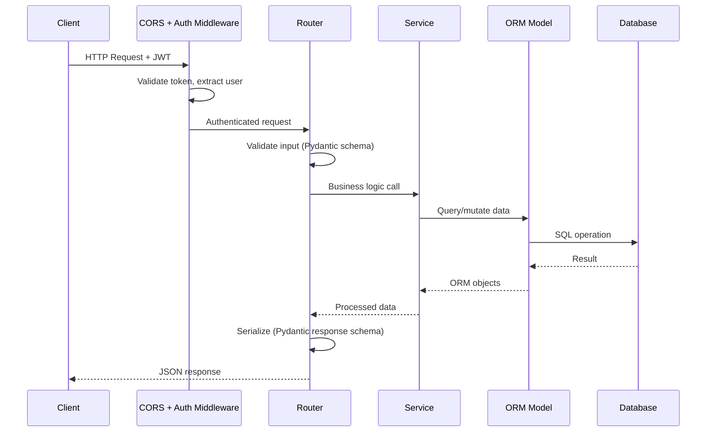

# ⚙️ UniAdvisorAI — Backend

<div align="center">

**FastAPI-powered backend with RAG-based AI recommendations, JWT auth, and comprehensive application tracking.**

[](https://fastapi.tiangolo.com/)
[](https://python.org/)
[](https://azure.microsoft.com/en-us/products/ai-services/openai-service)
[](https://www.sqlalchemy.org/)

</div>

---

## 🚀 Tech Stack

| Technology | Version | Purpose |
|------------|---------|---------|
| **FastAPI** | 0.109.0 | Async web framework |
| **Uvicorn** | 0.27.0 | ASGI server |
| **SQLAlchemy** | 2.0.25 | ORM & database toolkit |
| **Pydantic** | 2.6.0 | Data validation & serialization |
| **OpenAI SDK** | 1.12.0 | Azure OpenAI GPT-4 integration |
| **ChromaDB** | 0.4.22 | Vector database for RAG |
| **Sentence Transformers** | 2.3.1 | Text embeddings (`all-MiniLM-L6-v2`) |
| **python-jose** | 3.3.0 | JWT token handling |
| **APScheduler** | 3.10 | Background task scheduling |
| **PyPDF2** | 3.0 | PDF text extraction |
| **python-docx** | 1.1 | Word document parsing |
| **Pytesseract** | 0.3 | OCR for scanned documents |
| **Pillow** | 10.2 | Image processing |

---

## 📁 Project Structure

```
backend/
├── app/
│   ├── __init__.py                 # Package initialization
│   ├── main.py                     # FastAPI app entry point, lifespan events, CORS
│   ├── config.py                   # Pydantic settings (from .env)
│   ├── database.py                 # SQLAlchemy engine, session factory, Base
│   ├── auth.py                     # JWT auth, password hashing, user dependencies
│   │
│   ├── models/                     # SQLAlchemy ORM models (14 files)
│   │   ├── __init__.py             #   Exports all models
│   │   ├── user.py                 #   User accounts & roles
│   │   ├── user_profile.py         #   Academic profile, applications, checklist
│   │   ├── program.py              #   University programs
│   │   ├── scholarship.py          #   Scholarships
│   │   ├── application_tracker.py  #   Application phases & checklist items
│   │   ├── vault.py                #   Document vault & credentials
│   │   ├── community.py            #   Posts, comments, votes
│   │   ├── notification.py         #   Notifications & preferences
│   │   ├── cost_of_living.py       #   City expense data (9 categories)
│   │   ├── sop_draft.py            #   SOP draft storage
│   │   ├── cached_recommendation.py        #   Cached program recommendations
│   │   ├── cached_scholarship_recommendation.py  # Cached scholarship matches
│   │   └── token_usage.py          #   AI API token consumption
│   │
│   ├── schemas/                    # Pydantic DTOs (13 files)
│   │   ├── __init__.py             #   Exports all schemas
│   │   ├── user.py                 #   UserCreate, UserResponse, Token
│   │   ├── profile.py              #   ProfileCreate/Update/Response
│   │   ├── program.py              #   ProgramResponse, ProgramListResponse
│   │   ├── recommendation.py       #   RecommendationResponse, ChatResponse
│   │   ├── scholarship.py          #   ScholarshipResponse, EligibilityResponse
│   │   ├── application_tracker.py  #   ApplicationCreate/Update/Response, ChecklistItem
│   │   ├── vault.py                #   DocumentResponse, CredentialResponse
│   │   ├── community.py            #   PostResponse, CommentResponse
│   │   ├── notification.py         #   NotificationResponse, PreferenceResponse
│   │   ├── sop.py                  #   SOPGenerateRequest/Response, DraftResponse
│   │   ├── admin.py                #   AdminDashboardResponse
│   │   └── token_usage.py          #   TokenUsageStats, UserUsageDetail
│   │
│   ├── routers/                    # API endpoint handlers (15 files)
│   │   ├── __init__.py             #   Core router exports
│   │   ├── auth.py                 #   /api/auth — register, login, password reset
│   │   ├── users.py                #   /api/users — user management (admin)
│   │   ├── profile.py              #   /api/profile — profile CRUD, doc upload
│   │   ├── programs.py             #   /api/programs — browse, search, CRUD, import
│   │   ├── recommendations.py      #   /api/recommendations — AI matching, chat
│   │   ├── scholarships.py         #   /api/scholarships — listing, eligibility
│   │   ├── applications.py         #   /api/applications — tracker, checklist, GPA
│   │   ├── vault.py                #   /api/vault — documents & credentials
│   │   ├── community.py            #   /api/community — posts, comments, voting
│   │   ├── notifications.py        #   /api/notifications — CRUD, preferences
│   │   ├── sop.py                  #   /api/sop — SOP generation & drafts
│   │   ├── cv_generator.py         #   /api/cv — CV generation & AI feedback
│   │   ├── token_usage.py          #   /api/token-usage — usage analytics (admin)
│   │   └── models.py               #   Shared router models
│   │
│   └── services/                   # Business logic layer (9 files)
│       ├── __init__.py             #   Service exports
│       ├── azure_openai.py         #   Azure OpenAI integration (21 methods, 956 lines)
│       ├── rag_service.py          #   RAG pipeline: ChromaDB + SQL fallback (538 lines)
│       ├── program_service.py      #   Program search, filtering, matching
│       ├── scholarship_service.py  #   Scholarship data seeding & processing
│       ├── notification_service.py #   Notification creation, delivery, scheduling
│       ├── email_service.py        #   SMTP email templates & delivery
│       ├── document_parser.py      #   PDF/DOCX/OCR parsing
│       └── scheduler.py            #   APScheduler: deadlines, visa, weekly digest
│
├── data/                           # Static data files
│   ├── programs.json               #   Program dataset
│   ├── scholarships.json           #   DAAD scholarship dataset
│   └── sample_programs.json        #   Sample data for testing
│
├── uploads/                        # User-uploaded documents
│   └── [user_id]/                  #   Per-user folders
│
├── chroma_db/                      # ChromaDB vector store (auto-generated)
├── requirements.txt                # Python dependencies
├── .env                            # Environment variables (not committed)
└── daad_app.db                     # SQLite database (development)
```

---

## 🛠️ Installation

### Prerequisites
- **Python** ≥ 3.10
- **pip** (Python package manager)
- **Azure OpenAI** API access (endpoint + API key + deployment)
- **Tesseract OCR** (optional, for scanned document parsing)

### Steps

```bash
# 1. Navigate to backend
cd backend

# 2. Create virtual environment
python -m venv venv

# 3. Activate
source venv/bin/activate        # macOS/Linux
# venv\Scripts\activate         # Windows

# 4. Install dependencies
pip install -r requirements.txt

# 5. Configure environment
cp .env.example .env
# Edit .env — see Environment Variables section below
```

---

## 🚀 Running the Server

### Development Mode
```bash
python -m app.main
```
Or with hot-reload:
```bash
uvicorn app.main:app --reload --host 0.0.0.0 --port 8000
```

- **API:** http://localhost:8000
- **Swagger UI:** http://localhost:8000/docs
- **ReDoc:** http://localhost:8000/redoc

### Production Mode
```bash
uvicorn app.main:app --host 0.0.0.0 --port 8000 --workers 4
```

---

## 🔧 Environment Variables

| Variable | Description | Required | Default |
|----------|-------------|----------|---------|
| `DATABASE_URL` | Database connection string | No | `sqlite:///./daad_app.db` |
| `SECRET_KEY` | JWT signing secret (min 32 chars) | **Yes** | Dev placeholder |
| `ALGORITHM` | JWT algorithm | No | `HS256` |
| `ACCESS_TOKEN_EXPIRE_MINUTES` | Token expiry in minutes | No | `1440` (24h) |
| `AZURE_OPENAI_ENDPOINT` | Azure OpenAI API endpoint URL | **Yes** | — |
| `AZURE_OPENAI_API_KEY` | Azure OpenAI API key | **Yes** | — |
| `AZURE_OPENAI_DEPLOYMENT` | Model deployment name | **Yes** | `gpt-5-mini` |
| `AZURE_OPENAI_API_VERSION` | API version string | No | `2024-02-15-preview` |
| `FRONTEND_URL` | Frontend URL for CORS & emails | No | `http://localhost:3000` |
| `CORS_ORIGINS` | Allowed CORS origins (JSON array) | No | `["*"]` |
| `CHROMA_DB_PATH` | ChromaDB storage path | No | `./chroma_db` |
| `MAX_UPLOAD_SIZE` | Max file upload size (bytes) | No | `10485760` (10MB) |
| `ALLOWED_EXTENSIONS` | Accepted file extensions (JSON array) | No | `[".pdf", ".docx", ".doc"]` |
| `SMTP_HOST` | SMTP server (empty = disabled) | No | `""` |
| `SMTP_PORT` | SMTP port | No | `587` |
| `SMTP_USER` | SMTP username | No | `""` |
| `SMTP_PASSWORD` | SMTP password | No | `""` |
| `SMTP_FROM_EMAIL` | Sender email address | No | `noreply@uniadvisor.com` |
| `SMTP_FROM_NAME` | Sender display name | No | `UniAdvisor` |
| `SMTP_USE_TLS` | Enable TLS for SMTP | No | `true` |
| `DEBUG` | Enable debug mode | No | `true` |

### Example `.env` File
```env
# Database
DATABASE_URL=sqlite:///./daad_app.db

# JWT (CHANGE IN PRODUCTION!)
SECRET_KEY=generate-a-strong-random-secret-key-here-min-32-chars

# Azure OpenAI
AZURE_OPENAI_ENDPOINT=https://your-resource.openai.azure.com/
AZURE_OPENAI_API_KEY=your-api-key-here
AZURE_OPENAI_DEPLOYMENT=gpt-4

# Frontend
FRONTEND_URL=http://localhost:5173
CORS_ORIGINS=["http://localhost:5173", "http://localhost:3000"]

# Email (optional)
SMTP_HOST=smtp.gmail.com
SMTP_USER=your-email@gmail.com
SMTP_PASSWORD=your-app-password
```

---

## 🏗️ Architecture

### Layered Architecture

```
┌───────────────────────────────────────────────────────┐
│  Routers (API Layer)                                  │
│  HTTP endpoints, auth guards, request/response        │
│  15 router files · 70+ endpoints                      │
├───────────────────────────────────────────────────────┤
│  Services (Business Logic)                            │
│  AI integration, RAG, parsing, notifications          │
│  9 service files · Core intelligence                  │
├───────────────────────────────────────────────────────┤
│  Schemas (DTOs)                                       │
│  Pydantic validation, serialization, input/output     │
│  13 schema files · Type-safe API contracts            │
├───────────────────────────────────────────────────────┤
│  Models (ORM)                                         │
│  SQLAlchemy entities, relationships, migrations       │
│  14 model files · Database schema                     │
├───────────────────────────────────────────────────────┤
│  Database (Persistence)                               │
│  SQLite (dev) / PostgreSQL (prod) + ChromaDB vectors  │
└───────────────────────────────────────────────────────┘
```

### Request Flow



---

## 🔑 Authentication System

### Flow
1. **Registration:** `POST /api/auth/register` → creates User (hashed password)
2. **Login:** `POST /api/auth/login/json` → validates credentials → returns JWT
3. **Protected requests:** `Authorization: Bearer <token>` header → `get_current_user` dependency
4. **Admin requests:** `get_current_admin_user` dependency checks `role == ADMIN`
5. **Password reset:** `POST /api/auth/forgot-password` → email token (15 min) → `POST /api/auth/reset-password`

### Auth Dependencies
| Dependency | Purpose |
|------------|---------|
| `get_current_user` | Requires valid JWT, returns `User` |
| `get_optional_user` | Returns `User` or `None` (for mixed-auth endpoints) |
| `get_current_active_user` | Like above + checks `is_active` |
| `get_current_admin_user` | Like above + checks `role == ADMIN` |

---

## 📡 API Endpoints (Complete Reference)

All endpoints are prefixed with `/api`.

### Auth (`/api/auth`) — 7 endpoints
| Method | Endpoint | Auth | Description |
|--------|----------|------|-------------|
| `POST` | `/register` | ❌ | Register new user |
| `POST` | `/login` | ❌ | Login (OAuth2 form data) |
| `POST` | `/login/json` | ❌ | Login (JSON body) |
| `GET` | `/me` | ✅ | Get current user info |
| `POST` | `/refresh` | ✅ | Refresh JWT token |
| `POST` | `/forgot-password` | ❌ | Request password reset email |
| `POST` | `/reset-password` | ❌ | Reset password with token |

### Programs (`/api/programs`) — 12 endpoints
| Method | Endpoint | Auth | Description |
|--------|----------|------|-------------|
| `GET` | `/` | ❌ | List programs (filters: city, degree, language, field, search, page) |
| `GET` | `/cities` | ❌ | Get all cities with program counts |
| `GET` | `/universities` | ❌ | Get all universities with metadata |
| `GET` | `/universities/{name}/programs` | ❌ | Programs for a specific university |
| `GET` | `/statistics` | ❌ | Platform stats (program/university/city counts) |
| `GET` | `/search/semantic` | ❌ | RAG-powered semantic search |
| `GET` | `/{id}` | ❌ | Get program details by ID or slug |
| `POST` | `/` | 👑 | Create new program |
| `PUT` | `/{id}` | 👑 | Update program |
| `DELETE` | `/{id}` | 👑 | Delete program |
| `POST` | `/import/json` | 👑 | Bulk import programs from JSON |
| `POST` | `/index` | 👑 | Re-index RAG vector store |

### Recommendations (`/api/recommendations`) — 4 endpoints
| Method | Endpoint | Auth | Description |
|--------|----------|------|-------------|
| `POST` | `/` | ✅ | Get AI recommendations (query + filters) |
| `POST` | `/chat` | ✅ | Chat with AI advisor |
| `GET` | `/quick` | ❌ | Quick recommendations (no auth) |
| `GET` | `/for-profile` | ✅ | Auto-recommendations from profile |

### Profile (`/api/profile`) — 8 endpoints
| Method | Endpoint | Auth | Description |
|--------|----------|------|-------------|
| `GET` | `/` | ✅ | Get user profile |
| `POST` | `/` | ✅ | Create profile |
| `PUT` | `/` | ✅ | Update profile |
| `POST` | `/upload-document` | ✅ | Upload + AI-parse document |
| `GET` | `/applications` | ✅ | Get user's applications |
| `POST` | `/applications` | ✅ | Create application |
| `PUT` | `/applications/{id}` | ✅ | Update application |
| `DELETE` | `/applications/{id}` | ✅ | Delete application |

### Scholarships (`/api/scholarships`) — 3 endpoints
| Method | Endpoint | Auth | Description |
|--------|----------|------|-------------|
| `GET` | `/` | ❌ | List scholarships (filters: field, degree, nationality) |
| `GET` | `/eligible` | ✅ | AI-scored scholarships for user's profile |
| `GET` | `/{id}` | ❌ | Scholarship details |

### Applications (`/api/applications`) — Comprehensive tracker
| Method | Endpoint | Auth | Description |
|--------|----------|------|-------------|
| `GET` | `/` | ✅ | List user's applications with phase info |
| `POST` | `/` | ✅ | Create new application |
| `GET` | `/{id}` | ✅ | Application details with full checklist |
| `PUT` | `/{id}` | ✅ | Update application status/data |
| `DELETE` | `/{id}` | ✅ | Delete application |
| `GET` | `/{id}/checklist` | ✅ | Get application checklist items |
| `PUT` | `/{id}/checklist/{item_id}` | ✅ | Toggle checklist item |
| `POST` | `/{id}/calculate-gpa` | ✅ | Calculate German GPA equivalent |

### Vault (`/api/vault`) — 8 endpoints
| Method | Endpoint | Auth | Description |
|--------|----------|------|-------------|
| `GET` | `/documents` | ✅ | List vault documents |
| `POST` | `/documents` | ✅ | Upload document to vault |
| `DELETE` | `/documents/{id}` | ✅ | Delete document |
| `GET` | `/documents/{id}/download` | ✅ | Download document file |
| `GET` | `/credentials` | ✅ | List saved credentials |
| `POST` | `/credentials` | ✅ | Save credential |
| `PUT` | `/credentials/{id}` | ✅ | Update credential |
| `DELETE` | `/credentials/{id}` | ✅ | Delete credential |

### Community (`/api/community`) — 5 endpoints
| Method | Endpoint | Auth | Description |
|--------|----------|------|-------------|
| `GET` | `/posts` | ❌ | List posts (search, category, pagination) |
| `POST` | `/posts` | ✅ | Create new post |
| `GET` | `/posts/{id}` | ❌ | Post details with comments |
| `POST` | `/posts/{id}/comments` | ✅ | Add comment |
| `POST` | `/vote` | ✅ | Upvote/downvote post |

### Notifications (`/api/notifications`) — 6 endpoints
| Method | Endpoint | Auth | Description |
|--------|----------|------|-------------|
| `GET` | `/` | ✅ | Get notifications (paginated, filter: unread_only) |
| `GET` | `/unread-count` | ✅ | Get unread count |
| `PUT` | `/{id}/read` | ✅ | Mark single notification as read |
| `PUT` | `/mark-all-read` | ✅ | Mark all as read |
| `GET` | `/preferences` | ✅ | Get notification preferences |
| `PUT` | `/preferences` | ✅ | Update preferences per type |

### SOP Generator (`/api/sop`)
| Method | Endpoint | Auth | Description |
|--------|----------|------|-------------|
| `POST` | `/generate` | ✅ | Generate SOP with AI |
| `GET` | `/drafts` | ✅ | List saved SOP drafts |
| `POST` | `/drafts` | ✅ | Save SOP draft |
| `PUT` | `/drafts/{id}` | ✅ | Update draft |
| `DELETE` | `/drafts/{id}` | ✅ | Delete draft |

### CV Generator (`/api/cv`)
| Method | Endpoint | Auth | Description |
|--------|----------|------|-------------|
| `POST` | `/generate` | ✅ | Generate CV with AI |
| `POST` | `/feedback` | ✅ | Get AI feedback on CV |

### Token Usage (`/api/token-usage`) — Admin Only
| Method | Endpoint | Auth | Description |
|--------|----------|------|-------------|
| `GET` | `/stats` | 👑 | Aggregate token usage statistics |
| `GET` | `/users` | 👑 | Per-user usage list |
| `GET` | `/users/{id}` | 👑 | Detailed usage for specific user |
| `GET` | `/breakdown` | 👑 | Usage breakdown by operation type |

> **Legend:** ❌ Public · ✅ Authenticated · 👑 Admin Only

---

## 🧠 Services Deep Dive

### `azure_openai.py` — AI Integration (956 lines)
The central AI service. Key methods:
| Method | Purpose |
|--------|---------|
| `generate_response_async()` | Core GPT-4 call with token tracking |
| `calculate_match_score()` | Program-profile match scoring (0–100%) |
| `generate_recommendation_analysis()` | Detailed AI reasoning per program |
| `calculate_scholarship_eligibility()` | Scholarship compatibility scoring |
| `parse_document()` | Extract structured data from documents |
| `generate_sop()` | AI-powered SOP generation |
| `generate_cv_feedback()` | CV analysis with scoring & improvements |
| `chat_about_programs()` | Conversational advisor with context |

### `rag_service.py` — RAG Pipeline (538 lines)
| Method | Purpose |
|--------|---------|
| `index_programs()` | Convert programs → embeddings → ChromaDB |
| `search_programs()` | Semantic search with filter support |
| `_sql_search()` | SQL fallback when ChromaDB unavailable |
| `generate_recommendations()` | Full RAG pipeline: retrieve + augment + generate |

### `notification_service.py` — Notifications (490 lines)
| Method | Purpose |
|--------|---------|
| `create_notification()` | Create in-app + optional email notification |
| `send_deadline_reminders()` | Check deadlines at 30/7/1 day intervals |
| `send_visa_reminders()` | Visa appointment reminders |
| `send_weekly_digests()` | Monday 9 AM progress digest |
| `send_status_change_notification()` | On application status change |

### `email_service.py` — Email Templates
Rich HTML email templates for:
- Welcome emails
- Password reset
- Deadline reminders
- Visa appointment reminders
- Weekly progress digests

### `scheduler.py` — Background Tasks
Uses **APScheduler** with the following jobs:
| Schedule | Job | Description |
|----------|-----|-------------|
| Daily (9 AM) | `check_deadline_reminders` | Scan for upcoming deadlines |
| Daily (10 AM) | `check_visa_reminders` | Scan for visa appointments |
| Weekly (Monday 9 AM) | `send_weekly_digests` | Email progress summary |

---

## 💾 Database Models Reference

| Model | Table | Key Fields | Relationships |
|-------|-------|------------|---------------|
| `User` | `users` | email, username, role, is_active, is_verified | → Profile, Applications, Posts, Notifications |
| `UserProfile` | `user_profiles` | nationality, degree, cgpa, gpa_scale, skills, preferences | → User |
| `Program` | `programs` | name, university, city, degree_type, language, deadline, tuition | → Applications |
| `UserApplication` | `user_applications` | status, match_score, checklist_progress, visa_date | → User, Program, Checklist, Docs |
| `ChecklistItem` | `application_checklist_items` | category, title, is_completed | → Application |
| `DocumentRequirement` | `document_requirements` | doc_type, file_path, status | → Application |
| `ApplicationCredential` | `application_credentials` | portal_name, username, password | → Application |
| `Scholarship` | `scholarships` | title, provider, degree, eligibility, deadline | — |
| `CostOfLiving` | `cost_of_living` | city, rent types, food, transport, insurance, fees | — |
| `Post` | `posts` | title, content, category, vote_count | → User, Comments, Votes |
| `Comment` | `comments` | content, parent_id | → User, Post |
| `Vote` | `votes` | vote_type (+1/−1) | → User, Post |
| `Notification` | `notifications` | type, title, message, is_read, priority | → User |
| `UserNotificationPreference` | `user_notification_preferences` | per-type email/inapp toggles | → User |
| `TokenUsage` | `token_usage` | operation, prompt/completion tokens, cost, model | → User |
| `SOPDraft` | `sop_drafts` | title, content, program_info, is_favorite | → User |
| `VaultDocument` | `vault_documents` | category, filename, file_path, file_size | → User |
| `VaultCredential` | `vault_credentials` | portal_name, username, encrypted_password | → User |
| `CachedRecommendation` | `cached_recommendations` | profile_hash, results, expires_at | → User, Program |

---

## 🧪 Startup Lifecycle

When the server starts (`lifespan` in `main.py`):

1. **Initialize database** — create all tables if they don't exist
2. **Create default admin** — `admin@daad.de` / `admin123` (change in production!)
3. **Seed scholarships** — load Scholarships from JSON
4. **Index programs** — build ChromaDB vector index for RAG
5. **Start scheduler** — launch APScheduler background jobs

When the server shuts down:
1. **Stop scheduler** — gracefully terminate background jobs

---

## 🐳 Docker

```dockerfile
FROM python:3.11-slim

WORKDIR /app
COPY requirements.txt .
RUN pip install --no-cache-dir -r requirements.txt

COPY . .
EXPOSE 8000
CMD ["uvicorn", "app.main:app", "--host", "0.0.0.0", "--port", "8000"]
```

```bash
docker build -t uniadvisor-backend .
docker run -p 8000:8000 --env-file .env uniadvisor-backend
```

---

## 💻 Development Guide

### Adding a New Feature

```
1. Model     →  app/models/feature.py        (database table)
2. Schema    →  app/schemas/feature.py        (validation DTOs)
3. Service   →  app/services/feature_service.py  (business logic, optional)
4. Router    →  app/routers/feature.py        (API endpoints)
5. Register  →  app/main.py                   (include_router)
```

### Health Check Endpoints
| Endpoint | Purpose |
|----------|---------|
| `GET /` | Basic health (name, version, status) |
| `GET /health` | Detailed health check |
| `GET /api/health` | API-level health check |

### Interactive Docs
- **Swagger UI:** http://localhost:8000/docs — try endpoints with "Authorize" button
- **ReDoc:** http://localhost:8000/redoc — clean API documentation

---

## 📝 License

This project is part of the UniAdvisorAI platform.
