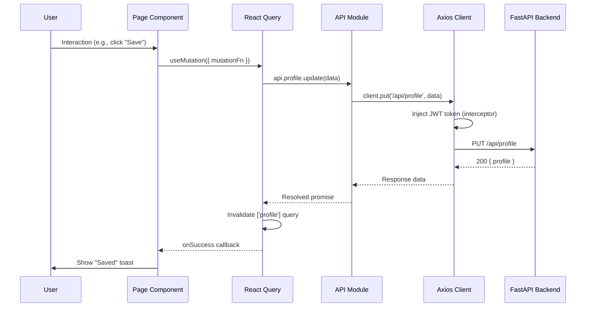

# 🎨 CampusConsul Frontend

<div align="center">

**Modern React + TypeScript frontend for discovering programs, tracking applications, and getting AI guidance for studying in Germany.**

[](https://reactjs.org/)
[](https://www.typescriptlang.org/)
[](https://vitejs.dev/)
[](https://tailwindcss.com/)

</div>

---

## 🚀 Tech Stack

| Technology | Version | Purpose |
|------------|---------|---------|
| **React** | 18.2.0 | UI framework |
| **TypeScript** | 5.3.3 | Type safety |
| **Vite** | 5.0.12 | Build tool & dev server (HMR) |
| **TailwindCSS** | 3.4.1 | Utility-first CSS styling |
| **React Query** (TanStack) | 5.17.0 | Server state, caching, mutations |
| **Zustand** | 4.4.7 | Lightweight client state management |
| **React Router DOM** | 6.21.2 | Client-side routing (31 routes) |
| **Framer Motion** | 10.18.0 | Page transitions & micro-animations |
| **Axios** | 1.6.5 | HTTP client with interceptors |
| **React Helmet Async** | 2.0 | Dynamic SEO meta tags |
| **react-hook-form** | 7.x | Form handling with validation |
| **jsPDF** | 2.5 | PDF export (SOP/CV tools) |
| **docx** | 8.5 | Word document export |
| **ReactMarkdown** | 9.0 | Render AI chat responses |
| **Lucide React** | 0.303 | Icon library |
| **React Hot Toast** | 2.4 | Toast notifications |
| **Recharts** | 2.12 | Dashboard charts |

---

## 📁 Project Structure

```
frontend/
├── public/                             # Static assets
│   └── v1.mp4                          #   Landing page video
├── src/
│   ├── App.tsx                         # Root component — all 31 routes
│   ├── main.tsx                        # React entry point (QueryClient, Helmet, Router)
│   ├── index.css                       # Global styles + Tailwind directives
│   │
│   ├── api/                            # Typed API client layer (12 modules)
│   │   ├── client.ts                   #   Axios instance, JWT interceptor, 401 handling
│   │   ├── index.ts                    #   Unified API exports
│   │   ├── auth.ts                     #   Login, register, password reset
│   │   ├── profile.ts                  #   Profile CRUD, document upload
│   │   ├── programs.ts                 #   Program browse, search, universities
│   │   ├── recommendations.ts          #   AI recommendations + chat
│   │   ├── scholarships.ts             #   Scholarship listing + eligibility
│   │   ├── applications.ts             #   Application tracker + checklist
│   │   ├── vault.ts                    #   Document vault + credentials
│   │   ├── community.ts               #   Posts, comments, voting
│   │   ├── notifications.ts            #   Notification CRUD + preferences
│   │   └── admin.ts                    #   Admin: users, token usage, data imports
│   │
│   ├── pages/                          # Page components (19 directories)
│   │   ├── Landing/                    #   🏠 Public landing page
│   │   │   └── LandingPage.tsx         #     Animated hero, stats, FAQ, CTAs (1,214 lines)
│   │   │
│   │   ├── Auth/                       #   🔐 Authentication
│   │   │   ├── LoginPage.tsx           #     Email/username login
│   │   │   ├── RegisterPage.tsx        #     User registration
│   │   │   ├── ForgotPasswordPage.tsx  #     Password reset request
│   │   │   └── ResetPasswordPage.tsx   #     Password reset form
│   │   │
│   │   ├── Dashboard/                  #   📊 Student dashboard
│   │   │   └── DashboardPage.tsx       #     Overview, progress, recommendations (512 lines)
│   │   │
│   │   ├── Profile/                    #   👤 User profile
│   │   │   └── ProfilePage.tsx         #     Multi-section profile editor with auto-save
│   │   │
│   │   ├── Programs/                   #   🎓 Program discovery
│   │   │   ├── ProgramsPage.tsx        #     Browse + filter + search (345 lines)
│   │   │   └── ProgramDetailPage.tsx   #     Individual program details
│   │   │
│   │   ├── Universities/               #   🏛️ University explorer
│   │   │   ├── UniversitiesPage.tsx    #     University listing + search
│   │   │   └── UniversityDetailPage.tsx#     University details + programs
│   │   │
│   │   ├── Recommendations/            #   🤖 AI recommendations + chat
│   │   │   └── RecommendationsPage.tsx #     Dual-tab: recommendations + AI chat (708 lines)
│   │   │
│   │   ├── Applications/               #   📋 Application tracker
│   │   │   ├── ApplicationTrackerPage.tsx  # 7-phase tracker (2,618 lines) ★ Largest
│   │   │   └── ApplicationsPage.tsx    #     Application list + phase summary
│   │   │
│   │   ├── Scholarships/               #   🎓 Scholarship matching
│   │   │   ├── ScholarshipsPage.tsx    #     Browse + AI eligibility (556 lines)
│   │   │   ├── ScholarshipDetailPage.tsx#    Scholarship details
│   │   │   └── index.ts
│   │   │
│   │   ├── CostOfLiving/              #   💰 Cost calculator
│   │   │   ├── CostOfLiving.jsx       #     City expense calculator
│   │   │   ├── CostOfLiving3.jsx      #     Alternative version
│   │   │   └── CostOfLiving_original.jsx#   Original version
│   │   │
│   │   ├── VisaGuide/                  #   ✈️ Visa process guide
│   │   │   └── VisaGuidePage.tsx       #     Step-by-step visa guide
│   │   │
│   │   ├── CountryGuide/               #   🌍 Per-country guides
│   │   │   └── CountryGuidePage.tsx    #     /study-in-germany/from/:country
│   │   │
│   │   ├── GermanGradeCalculator/      #   📐 GPA converter
│   │   │   └── GermanGradeCalculatorPage.tsx  # Modified Bavarian Formula
│   │   │
│   │   ├── Tools/                      #   🔧 AI tools
│   │   │   ├── SOPGeneratorPage.tsx    #     AI SOP with drafts, export (1,011 lines)
│   │   │   └── CVGeneratorPage.tsx     #     AI CV with feedback (1,915 lines)
│   │   │
│   │   ├── Vault/                      #   🗄️ Document vault
│   │   │   └── VaultPage.tsx           #     Upload, manage, download docs (226 lines)
│   │   │
│   │   ├── Community/                  #   👥 Forum
│   │   │   ├── CommunityPage.tsx       #     Posts feed + create post (188 lines)
│   │   │   └── PostDetailPage.tsx      #     Post + comments
│   │   │
│   │   ├── Settings/                   #   ⚙️ User settings
│   │   │   └── SettingsPage.tsx        #     Notification preferences
│   │   │
│   │   ├── Admin/                      #   👑 Admin dashboard
│   │   │   ├── AdminPage.tsx           #     Tab container (511 lines)
│   │   │   ├── UsersTab.tsx            #     User management table
│   │   │   ├── UsageTab.tsx            #     Token usage analytics
│   │   │   └── UserDetailModal.tsx     #     User detail popup
│   │   │
│   │   └── Legal/                      #   📜 Legal pages
│   │       ├── PrivacyPolicyPage.tsx   #     Privacy policy
│   │       └── TermsOfServicePage.tsx  #     Terms of service
│   │
│   ├── components/                     # Reusable UI components (14 directories)
│   │   ├── ui/                         #   Atomic components (11 files)
│   │   │   ├── Badge.tsx               #     Status badges
│   │   │   ├── Button.tsx              #     Button variants
│   │   │   ├── Card.tsx                #     Card container
│   │   │   ├── EmptyState.tsx          #     Empty state placeholder
│   │   │   ├── Input.tsx               #     Form input field
│   │   │   ├── LoadingSpinner.tsx      #     Loading indicator
│   │   │   ├── Modal.tsx               #     Modal dialog
│   │   │   ├── Select.tsx              #     Dropdown select
│   │   │   ├── Tabs.tsx                #     Tab navigation
│   │   │   ├── Tooltip.tsx             #     Tooltip popover
│   │   │   └── index.ts               #     Exports
│   │   │
│   │   ├── layout/                     #   Layout structure (4 files)
│   │   │   ├── Header.tsx              #     Navigation header + mobile menu
│   │   │   ├── Footer.tsx              #     Page footer with links
│   │   │   ├── Layout.tsx              #     Main layout wrapper (Header + Outlet + Footer)
│   │   │   └── index.ts
│   │   │
│   │   ├── auth/                       #   Auth components (2 files)
│   │   │   ├── ProtectedRoute.tsx      #     Route guard (auth + admin check)
│   │   │   └── index.ts
│   │   │
│   │   ├── programs/                   #   Program components (3 files)
│   │   │   ├── ProgramCard.tsx         #     Program card (grid/list views)
│   │   │   ├── MatchScore.tsx          #     Circular match score indicator
│   │   │   └── index.ts
│   │   │
│   │   ├── scholarships/              #   Scholarship components (2 files)
│   │   │   ├── ScholarshipCard.tsx     #     Scholarship display card
│   │   │   └── index.ts
│   │   │
│   │   ├── universities/              #   University components (2 files)
│   │   │   ├── UniversityCard.tsx      #     University display card
│   │   │   └── index.ts
│   │   │
│   │   ├── dashboard/                  #   Dashboard widgets (2 files)
│   │   │   ├── ApplicationProgressChart.tsx  # Progress chart (Recharts)
│   │   │   └── index.ts
│   │   │
│   │   ├── vault/                      #   Vault components (2 files)
│   │   │   ├── DocumentList.tsx        #     Document list with actions
│   │   │   └── CredentialManager.tsx   #     Credential CRUD
│   │   │
│   │   ├── community/                  #   Community components (3 files)
│   │   │   ├── PostCard.tsx            #     Post preview card
│   │   │   ├── CreatePostModal.tsx     #     Post creation modal
│   │   │   └── index.ts
│   │   │
│   │   ├── notifications/              #   Notification components (2 files)
│   │   │   ├── NotificationBell.tsx    #     Header bell icon with unread count
│   │   │   └── NotificationList.tsx    #     Notification dropdown/panel
│   │   │
│   │   ├── profile/                    #   Profile components
│   │   │   └── ProfileOnboarding.tsx   #     Step-by-step onboarding wizard
│   │   │
│   │   ├── onboarding/                #   Onboarding flow components
│   │   │
│   │   ├── common/                     #   Shared components
│   │   │   └── SEO.tsx                 #     React Helmet SEO wrapper
│   │   │
│   │   └── CostOfLiving/             #   Cost of living components
│   │
│   ├── store/                          # Zustand state stores
│   │   ├── authStore.ts                #   Auth state (user, token, login/logout)
│   │   └── index.ts
│   │
│   ├── lib/                            # Utilities
│   │   └── queryClient.ts             #   React Query client configuration
│   │
│   └── types/                          # TypeScript definitions
│       └── index.ts                    #   Shared interfaces & types
│
├── index.html                          # HTML entry point
├── package.json                        # Dependencies & scripts
├── vite.config.ts                      # Vite configuration
├── tailwind.config.js                  # Tailwind customization
├── postcss.config.js                   # PostCSS plugins
├── tsconfig.json                       # TypeScript config
└── tsconfig.node.json                  # Node TypeScript config
```

---

## 🛠️ Installation

### Prerequisites
- **Node.js** ≥ 18.x
- **npm** ≥ 9.x (or yarn/pnpm)

### Steps

```bash
# 1. Navigate to frontend
cd frontend

# 2. Install dependencies
npm install

# 3. Create environment file
echo "VITE_API_URL=http://localhost:8000" > .env
```

---

## 🚀 Running the Application

### Development
```bash
npm run dev
```
- **Local:** http://localhost:5173
- **Network:** displayed in terminal

### Production Build
```bash
npm run build      # Build to dist/
npm run preview    # Preview production build locally
```

### Available Scripts
| Command | Description |
|---------|-------------|
| `npm run dev` | Start Vite dev server with HMR |
| `npm run build` | TypeScript check + production build |
| `npm run preview` | Serve production build locally |
| `npm run lint` | Run ESLint |

---

## 🌐 Environment Variables

| Variable | Description | Default |
|----------|-------------|---------|
| `VITE_API_URL` | Backend API base URL | `http://localhost:8000` |

---

## 🗺️ Routing Architecture

The app defines **31 routes** in `App.tsx`:

### Public Routes (No Auth Required)
| Route | Page | Description |
|-------|------|-------------|
| `/` | `LandingPage` | Landing (redirects to `/dashboard` if authenticated) |
| `/login` | `LoginPage` | Login form |
| `/register` | `RegisterPage` | Registration form |
| `/forgot-password` | `ForgotPasswordPage` | Password reset request |
| `/reset-password` | `ResetPasswordPage` | Token-based password reset |
| `/programs` | `ProgramsPage` | Browse programs (public) |
| `/programs/:id` | `ProgramDetailPage` | Program details |
| `/universities` | `UniversitiesPage` | Browse universities |
| `/universities/:name` | `UniversityDetailPage` | University details |
| `/scholarships` | `ScholarshipsPage` | Browse scholarships |
| `/scholarships/:id` | `ScholarshipDetailPage` | Scholarship details |
| `/community` | `CommunityPage` | Forum posts |
| `/community/posts/:id` | `PostDetailPage` | Post with comments |
| `/costofliving` | `CostOfLiving` | Cost calculator |
| `/cost-of-living/:city` | `CostOfLiving` | City-specific costs |
| `/visa-guide` | `VisaGuidePage` | Visa process guide |
| `/study-in-germany/from/:country` | `CountryGuidePage` | Country guides |
| `/german-grade-calculator` | `GermanGradeCalculatorPage` | GPA converter |
| `/privacy-policy` | `PrivacyPolicyPage` | Legal |
| `/terms-of-service` | `TermsOfServicePage` | Legal |

### Protected Routes (Auth Required)
| Route | Page | Description |
|-------|------|-------------|
| `/dashboard` | `DashboardPage` | Student dashboard |
| `/profile` | `ProfilePage` | Profile editor |
| `/recommendations` | `RecommendationsPage` | AI recommendations + chat |
| `/applications` | `ApplicationsPage` | Application list |
| `/applications/:id` | `ApplicationTrackerPage` | 7-phase tracker |
| `/vault` | `VaultPage` | Document vault |
| `/tools/sop-generator` | `SOPGeneratorPage` | AI SOP tool |
| `/tools/cv-generator` | `CVGeneratorPage` | AI CV tool |
| `/settings/notifications` | `SettingsPage` | Notification preferences |

### Admin-Only Routes
| Route | Page | Description |
|-------|------|-------------|
| `/admin` | `AdminPage` | Admin dashboard |

### Route Protection
```tsx
// ProtectedRoute component wraps authenticated pages
<ProtectedRoute>
  <DashboardPage />
</ProtectedRoute>

// Admin check
<ProtectedRoute adminOnly>
  <AdminPage />
</ProtectedRoute>
```

---

## 🏗️ Architecture

### State Management

```
┌───────────────────────────────────────┐
│  React Query (Server State)           │
│  • Caching with configurable TTL      │
│  • Background refetching              │
│  • Optimistic updates                 │
│  • Automatic retry on failure         │
│  • Query invalidation on mutations    │
├───────────────────────────────────────┤
│  Zustand (Client State)              │
│  • authStore: user, token, login/out  │
│  • Persistent auth across tabs        │
├───────────────────────────────────────┤
│  Component State (React useState)     │
│  • Form inputs, modals, UI toggles    │
│  • Page-level filters & search        │
└───────────────────────────────────────┘
```

### API Layer

The `api/client.ts` configures a global Axios instance with:

| Feature | Implementation |
|---------|---------------|
| **Base URL** | `VITE_API_URL` from env |
| **Auth injection** | Request interceptor adds `Bearer <token>` header |
| **401 handling** | Response interceptor clears auth state → redirect to login |
| **Content-Type** | Default `application/json` |

Each API module (`api/programs.ts`, `api/vault.ts`, etc.) exports typed functions:
```typescript
// Example: api/vault.ts
export const vaultApi = {
  getDocuments: () => client.get('/api/vault/documents'),
  uploadDocument: (formData: FormData) => client.post('/api/vault/documents', formData),
  deleteDocument: (id: number) => client.delete(`/api/vault/documents/${id}`),
  downloadDocument: (id: number) => client.get(`/api/vault/documents/${id}/download`),
  // ... credentials
};
```

### Data Flow



---

## 🎨 Styling System

### TailwindCSS Configuration
- **Custom color palette** for brand consistency
- **Extended animations** (fade-in, slide-up, bounce)
- **Custom fonts** (Google Fonts: Inter / Outfit)
- **Dark/light mode** ready via class strategy
- **Responsive breakpoints:** Mobile (<768px), Tablet (768–1024px), Desktop (>1024px)

### Animation Strategy (Framer Motion)
| Animation | Usage |
|-----------|-------|
| Page transitions | Fade + slide on route changes |
| Section reveals | Scroll-triggered on landing page |
| Counter animations | Animated number counting (stats) |
| Card hover effects | Scale + shadow transitions |
| Modal/dropdown | Spring-based enter/exit |
| Loading states | Skeleton pulses, spinners |

---

## 🔍 SEO Implementation

The `SEO` component (`components/common/SEO.tsx`) wraps every page with:

```tsx
<SEO
  title="Browse Programs"
  description="Find 500+ Master's programs at German universities"
  keywords={["study in Germany", "master programs"]}
  canonical="/programs"
  schema={{
    "@context": "https://schema.org",
    "@type": "WebApplication",
    "name": "CampusConsul"
  }}
  hreflangs={[
    { lang: "en", href: "https://campusconsul.com/programs" }
  ]}
/>
```

**Generated Tags:**
- `<title>` — page-specific + brand
- `<meta name="description">` — unique per page
- `<meta name="keywords">` — relevant keywords
- `<link rel="canonical">` — canonical URL
- `<link rel="alternate" hreflang="...">` — international targeting
- Open Graph tags (`og:title`, `og:description`, `og:type`)
- Twitter Card tags (`twitter:card`, `twitter:title`, `twitter:description`)
- JSON-LD structured data (Schema.org)

---

## 📋 Pages Quick Reference

| Page | File | Lines | Key Features |
|------|------|-------|--------------|
| **Landing** | `LandingPage.tsx` | 1,214 | Animated hero, live stats, FAQ, CTAs |
| **Dashboard** | `DashboardPage.tsx` | 512 | Profile completion, app progress, quick actions |
| **Programs** | `ProgramsPage.tsx` | 345 | Filter bar, grid/list toggle, pagination |
| **Recommendations** | `RecommendationsPage.tsx` | 708 | AI cards + chat with markdown rendering |
| **Application Tracker** | `ApplicationTrackerPage.tsx` | 2,618 | 7-phase tabs, country metadata, GPA calc |
| **Scholarships** | `ScholarshipsPage.tsx` | 556 | Filter + "Find My Scholarships" AI button |
| **SOP Generator** | `SOPGeneratorPage.tsx` | 1,011 | AI generation, drafts, PDF/Word export |
| **CV Generator** | `CVGeneratorPage.tsx` | 1,915 | Multi-step form, AI feedback panel, export |
| **Admin** | `AdminPage.tsx` | 511 | User table, token analytics, data import |
| **Vault** | `VaultPage.tsx` | 226 | Upload, download, credential manager |
| **Community** | `CommunityPage.tsx` | 188 | Posts feed, voting, create modal |
| **Profile** | `ProfilePage.tsx` | ~500 | Auto-save, multi-section, doc upload |

---

## 💻 Development Guide

### Adding a New Page

1. **Create page component:**
   ```
   src/pages/NewFeature/NewFeaturePage.tsx
   ```

2. **Add API module** (if needed):
   ```
   src/api/newFeature.ts
   ```
   ```typescript
   import client from './client';
   
   export const newFeatureApi = {
     getAll: () => client.get('/api/new-feature').then(r => r.data),
     create: (data: CreateRequest) => client.post('/api/new-feature', data).then(r => r.data),
   };
   ```

3. **Add route** in `src/App.tsx`:
   ```tsx
   import NewFeaturePage from './pages/NewFeature/NewFeaturePage';
   
   // Public route
   <Route path="/new-feature" element={<NewFeaturePage />} />
   
   // Or protected route
   <Route path="/new-feature" element={
     <ProtectedRoute><NewFeaturePage /></ProtectedRoute>
   } />
   ```

4. **Add navigation** in `components/layout/Header.tsx`

5. **Add SEO** to the page:
   ```tsx
   import SEO from '../../components/common/SEO';
   
   export default function NewFeaturePage() {
     return (
       <>
         <SEO title="New Feature" description="..." />
         {/* page content */}
       </>
     );
   }
   ```

### Adding a New Reusable Component

1. Create in `src/components/[category]/ComponentName.tsx`
2. Export from the category's `index.ts`
3. Keep components **single-responsibility** and **props-driven**

### Using React Query

```typescript
// Fetching data
const { data, isLoading, error } = useQuery({
  queryKey: ['programs', filters],
  queryFn: () => programsApi.getAll(filters),
});

// Mutating data
const mutation = useMutation({
  mutationFn: programsApi.create,
  onSuccess: () => {
    queryClient.invalidateQueries({ queryKey: ['programs'] });
    toast.success('Program created!');
  },
});
```

---

## 📦 Key Dependencies

### UI & Styling
| Package | Purpose |
|---------|---------|
| `tailwindcss` | Utility-first CSS |
| `framer-motion` | Animations |
| `lucide-react` | Icon library |
| `react-hot-toast` | Toast notifications |
| `@headlessui/react` | Accessible UI primitives |

### Data & State
| Package | Purpose |
|---------|---------|
| `@tanstack/react-query` | Server state management |
| `zustand` | Client state management |
| `axios` | HTTP client |
| `react-hook-form` | Form handling |

### Routing & SEO
| Package | Purpose |
|---------|---------|
| `react-router-dom` | Client routing |
| `react-helmet-async` | SEO meta tags |

### Export & Rendering
| Package | Purpose |
|---------|---------|
| `jspdf` | PDF generation |
| `docx` | Word document generation |
| `react-markdown` | Markdown rendering (AI chat) |
| `remark-gfm` | GitHub-flavored markdown |
| `rehype-highlight` | Code syntax highlighting |

### Charts & Visualization
| Package | Purpose |
|---------|---------|
| `recharts` | Dashboard charts |
| `d3-scale`, `d3-shape` | Data visualization |

---

## 📝 License

This project is part of the CampusConsul platform.
